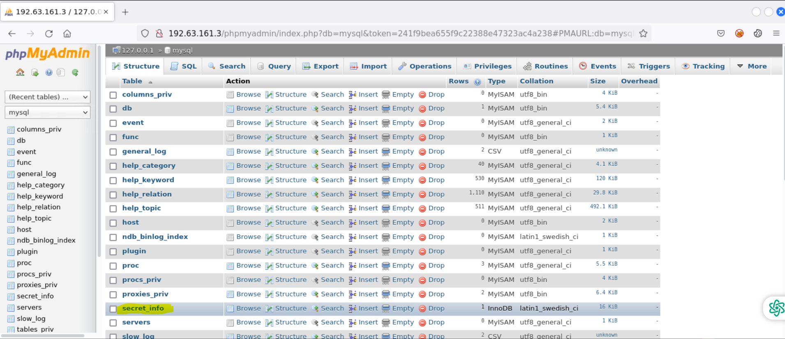

Let's dive into our CTF challenge: **Vulnerability Assessment!**

****

This CTF lab provides Nessus credentials, but I don’t think Nessus is necessary for this challenge. However, if you're curious and want to explore further, you can run a Nessus scan on the target system for additional insights.

**Q.1 Explore hidden directories for version control artifacts that might reveal valuable information.**

Before answering any questions, I recommend running an Nmap script scan and version scan to get a better understanding of the target system. We'll start with the following command:

```bash
nmap -sC -sV target.ine.local --script vuln --min-rate 1000
```

The `--script vuln` option runs basic vulnerability detection scripts to identify potential security weaknesses.

After reviewing the scan results and conducting further enumeration, we found that the `--script` command revealed the `.git` directory is accessible on the web server.

less /etc/hosts


more /etc/hosts


cat /etc/hosts


&nbsp;

You can use one of these commands to find the IP address of the host "target.ine.local," or you can simply use "target.ine.local" instead of the IP address when running an nmap scan.


gobuster dir -u http://IP -w /usr/share/wordlists/dirb/common.txt

gobuster dir -u http://target.ine.local -w /usr/share/wordlists/dirb/common.txt


<span style="color: #242424;">Navigate to the</span> `.git` <span style="color: #242424;">directory.</span>

<span style="color: #242424;"></span>

<span style="color: #242424;">http://192.63.161.3/:8005521515</span>

<span style="color: #242424;"></span>

<span style="color: #242424;">http://192.63.161.3/.git/</span>

<span style="color: #242424;"></span>

<span style="color: #242424;">http://192.63.161.3/.git/flag.txt</span>

<span style="color: #242424;"></span>

**<span style="color: #404040;">Q.2 The data storage has some loose security measures. Can you find the flag hidden within it?</span>**

<span style="color: #404040;">The question mentions 'data storage,' so the flag is likely in internal files. Since nmap shows phpMyAdmin is open to the public, we can use this to find the flag.</span>

<span style="color: #404040;"><span style="color: #404040;">Use your browser to navigate to the phpMyAdmin directory.</span></span>

<span style="color: #404040;"><span style="color: #404040;"></span></span>

<span style="color: #404040;"><span style="color: #404040;"><span style="color: #404040;">On the left, you’ll see databases. Search through them to find the flag. It’s in the ‘mysql’ database. Click ‘mysql’ to view its contents.</span></span></span>

<span style="color: #404040;"><span style="color: #404040;"><span style="color: #404040;"></span></span></span>

<span style="color: #404040;"><span style="color: #404040;"><span style="color: #404040;"><span style="color: #404040;">Locate the</span> **secret_info** <span style="color: #404040;">table in MySQL, click on it, and get the flag.</span></span></span></span>

<span style="color: #404040;"><span style="color: #404040;"><span style="color: #404040;"></span></span></span>

**Q.3 A PHP file that displays server information might be worth examining. What could be hidden in plain sight?**

<span style="color: #404040;">The nmap scan with the</span> **http-enum** <span style="color: #404040;">script showed that the server has a</span> **phpinfo.php** <span style="color: #404040;">file.</span>

<span style="color: #404040;">http://192.63.161.3/phpinfo.php</span>

<span style="color: #404040;"></span>

**Q.4 Sensitive directories might hold critical information. Search through carefully for hidden gems.**

<span style="color: #404040;">The question hints that some directories may contain important data. Nmap found a 'passwords' directory on the server.</span>

<span style="color: #404040;">http://192.63.161.3/passwords/</span>

<span style="color: #404040;"></span>

<span style="color: #404040;"></span>
