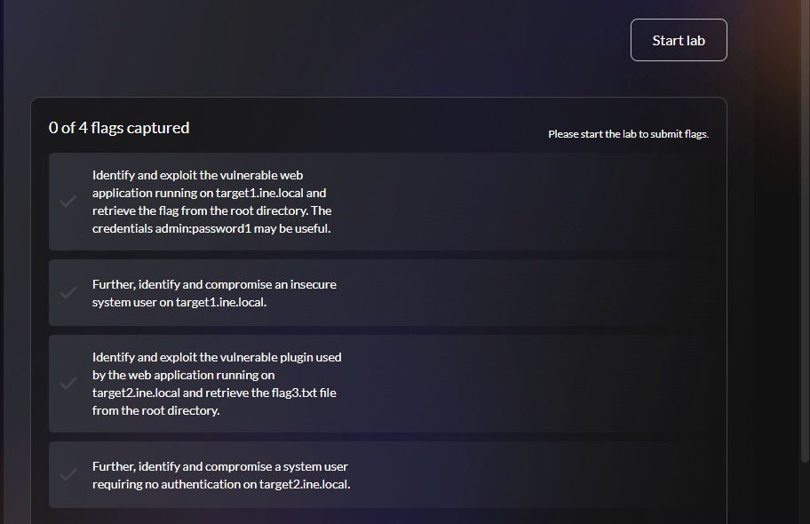
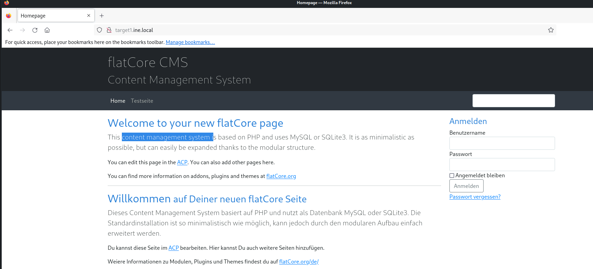
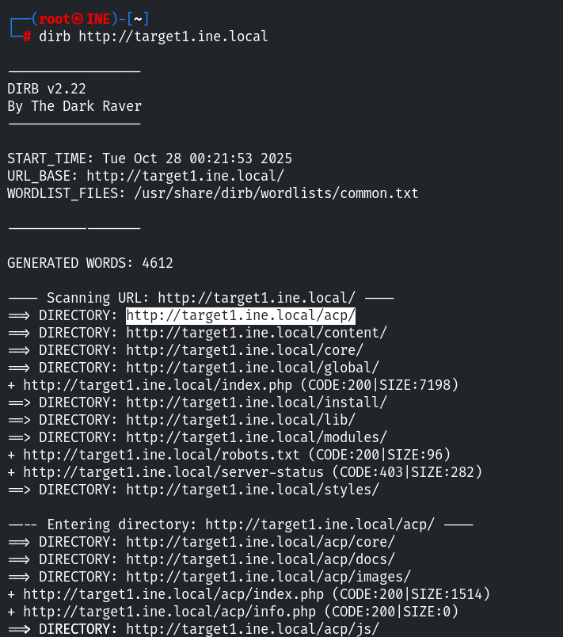
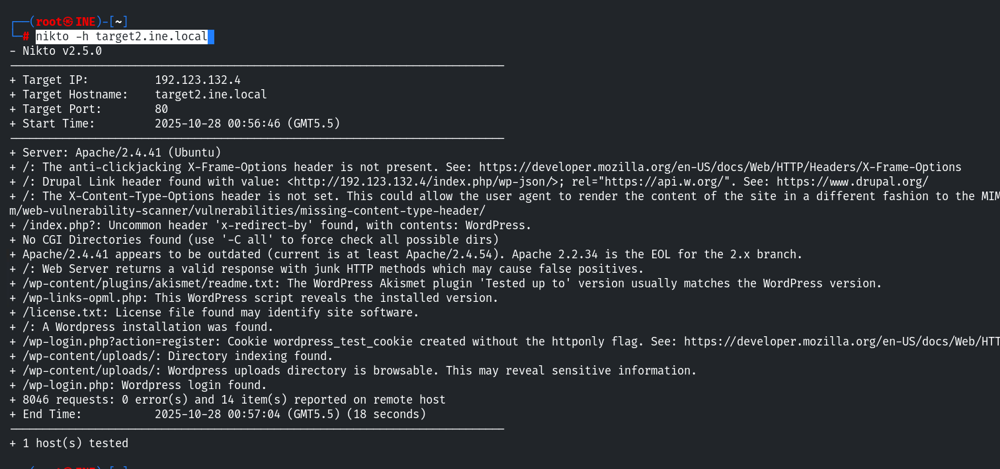

### Completing Skill Check Labs

Skill Check Labs are interactive, hands-on exercises designed to validate the knowledge and skills you’ve gained in this course through real-world scenarios. Each lab presents practical tasks that require you to apply what you’ve learned. Unlike other INE labs, solutions are not provided, challenging you to demonstrate your understanding and problem-solving abilities. Your performance is graded, allowing you to track progress and measure skill growth over time.

# Lab Environment

Two Linux machines are accessible at **target1.ine.local** and **target2.ine.local**. Identify the application and service running on these machines, and capture the flags. The flag is an md5 hash format.

- **Flag 1:** Identify and exploit the vulnerable web application running on **target1.ine.local** and retrieve the flag from the root directory. The credentials **admin:password1** may be useful.
- **Flag 2:** Further, identify and compromise an insecure system user on **target1.ine.local**.
- **Flag 3:** Identify and exploit the vulnerable plugin used by the web application running on **target2.ine.local** and retrieve the **flag3.txt** file from the root directory.
- **Flag 4:** Further, identify and compromise a system user requiring no authentication on **target2.ine.local**.

The following wordlists will be useful:

- /usr/share/nmap/nselib/data/wp-plugins.lst
- /usr/share/metasploit-framework/data/wordlists/unix_passwords.txt

# Tools

- Nmap
- Hydra
- Dirb
- Python3
- Metasploit

We’ve now entered the exploitation phase of our journey. This stage focuses on leveraging identified vulnerabilities to gain access and demonstrate potential risks.

Let’s begin with the first question. Both of the initial questions are related to the same host, `target1.ine.local`.

**Flag.1 Identify and exploit the vulnerable web application running on target1.ine.local and retrieve the flag from the root directory. The credentials admin:password1 may be useful.**

As usual, we begin with **Nmap** to scan for open ports and services using the following command `namp -sC -sV target1.ine.local` .

This scan helps us identify potential entry points by detecting running services and their versions. From here, we analyze the results and proceed with exploitation.

cat /etc/hosts

Both of the initial questions are related to the same host, `target1.ine.local`.

nmap -sC -sV target1.ine.local

From the Nmap scan results, we can see that port 80 is open, indicating that a web server is running on this port.

Let’s navigate to the website in a browser and analyze its content for potential vulnerabilities.

dirb http://target1.ine.local

After examining the website and did the dirb, we can confirm that it is running on **Flatcore** and has a login form. The question provides us with the credentials `admin:password1`.

\[Flag.1 Identify and exploit the vulnerable web application running on target1.ine.local and retrieve the flag from the root directory. The credentials admin:password1 may be useful.\]

We can use these credentials to log in directly, or alternatively, we can attempt to log in via the following endpoint: `http://target1.ine.local/acp/`

After logging in, you will see a dashboard or an admin panel that looks something like this:

Now that we have enumerated the application, it’s time to move on to the exploitation phase. Our goal is to gain access to the root directory.

Since the website is running on **Flatcore**, we should check if there are any known exploits available for this CMS. We can do this using the following command:

searchsploit flatcore

This command searches the Exploit-DB database for publicly available exploits related to Flatcore. If an exploit is found, we can analyze its details and attempt to use it for further exploitation.

As you can see, there are two available exploits, but neither is present in Metasploit\*\*.\*\* This means we need to execute the exploit manually on our system. Since our goal is to gain access to the root system, we will use the first exploit, which is Remote Code Execution (Authenticated).

To copy the exploit’s Python code into our current working directory, we can use the following command:

searchsploit -m 50262

**Note:** `50262` is the exploit ID we are copying from the Exploit-DB database. Once copied, we can analyze and modify it if necessary before executing it.

Before executing the exploit, we should first read and analyze the code to understand how it works. We can use various tools for this, such as: cat, vim, or mousepad, etc.

After reviewing the code, we can determine how to execute the exploit. To run the Python script and attempt exploitation, we use the following command:

python3 50262.py http://target1.ine.local/ admin password1

We have successfully logged in using the exploit. Now, to retrieve our first flag, we need to access the **root directory.** First, we list the directory contents using the following command:

ls /

And here we have our first flag, which we can read using the command:

cat /flag1.txt

FLAG1{442b8d6ad6644f1fb3a24ca3cc2b9506}

**Flag.2 Further, identify and compromise an insecure system user on target1.ine.local.**

To proceed with the compromise, we first need to enumerate the users on the target system. User directories are typically located in the `/home` directory, so let's list its contents using the command: `ls -l /home`

And here we discovered a user named `iamaweakuser`. As the name suggests, this user likely has a weak password.

Since our initial `Nmap` scan revealed that the `SSH` port is open, we can attempt to brute-force the password using `Hydra`.

hydra -l iamaweakuser -P /usr/share/metasploit-framework/data/wordlists/unix_passwords.txt target1.ine.local ssh

So now, we have the password. Let’s log in to the SSH service using the command:

ssh iamaweakuser@target1.ine.local

To list the contents, type `ls`, and to read the flag, use `cat flag2.txt`. Here we got our second flag!

FLAG2{effd6cf2db0b47f6a504a464274dd729}

Now, the last two questions are related to another target, `target2.ine.local`.

**Flag.3 Identify and exploit the vulnerable plugin used by the web application running on target2.ine.local and retrieve the flag3.txt file from the root directory.**

This flag took more time for me because, at a certain point, I was confused about which exploit to use.

As usual, we start with an Nmap scan using our basic command

nmap -sC -sV target2.ine.local

So, port 80 is open. Let’s navigate to the website.

Press enter or click to view image in full size

And after analyzing, we can confirm that this website is running on `WordPress`. Our next step is to enumerate the vulnerable plugin.

Since it’s a `WordPress` site, our first instinct is to run `wpscan`

wpscan --url http://target2.ine.local/

but unfortunately, it didn't reveal anything interesting related to plugins.

To dig deeper, I ran Nikto using the command: nikto -h target2.ine.local

And here, we discovered a plugin named `Akismet`, but after enumeration, it turned out to be not vulnerable.

Next, I attempted to brute-force the plugin directory using the following command:

gobuster dir -u http://target2.ine.local/wp-content/plugins/ -w /usr/share/nmap/nselib/data/wp-plugins.lst

So now, we found another plugin named **Duplicator**. Let’s search for its vulnerabilities using

searchsploit duplicator

So there are multiple exploits available. One of them is an arbitrary file read exploit in Metasploit.

Let’s use it by running msfconsole and search that particular module.

msfconsole

search duplicator

Interact with the module by typing `use 1` and then `options` to list the required parameters.

So we need to set only `RHOSTS` as `target2.ine.local` and run the exploit.

set RHOSTS target2.ine.local

And the exploit executed successfully. Now, the third flag is in the root directory. Let’s read it by setting the `FILEPATH` to `/flag3.txt`.

And here we got our third flag which is:

FLAG3{177eafc58a0d453797b86fd142a0803e}

**Flag.4 Further, identify and compromise a system user requiring no authentication on target2.ine.local.**

****

While running `/etc/passwd` during the arbitrary file read, we discovered a user named **iamacrazyfreeuser**, who has direct access to bash.

From the Nmap scan, we know that SSH is open, so let’s try connecting using

ssh iamacrazyfreeuser@target2.ine.local

And we got access **without any password**, Now, for our last flag, we need to list the files

FLAG4{29179543c5dc4a53a6f1ec0540da9dc7}

