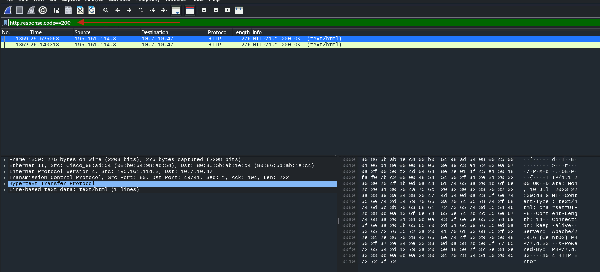
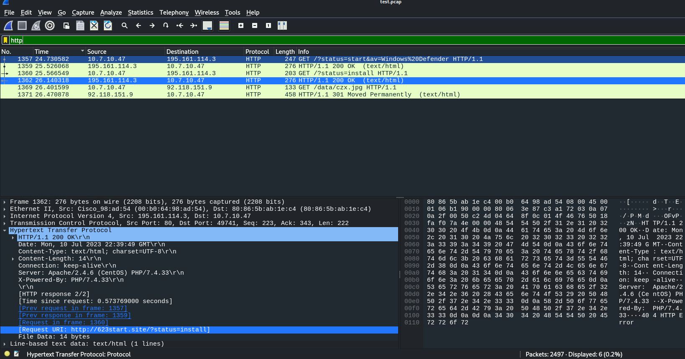
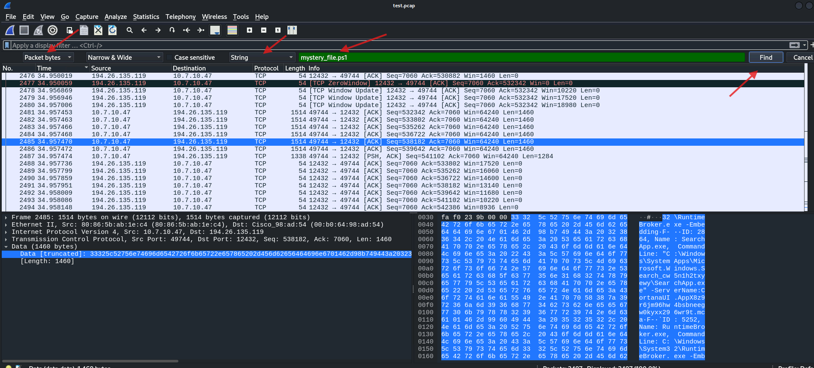

# Lab Environment

In this lab environment, you will have GUI access to a Kali machine with access to a captured network packet file **test.pcap**.

**Objective:** Use network analysis techniques to identify and capture the following flags related to the infection and attack:

- **Flag 1:** What is the domain name(abcd.site) accessed by the infected user that returned a 200 OK response code?
- **Flag 2:** What is the IP address, MAC address of the infected Windows client?
- **Flag 3:** Which Wireshark filter can you use to determine the victim’s hostname from NetBIOS Name Service traffic, and what is the detected hostname for this malware infection?
- **Flag 4:** Which user got infected and ran the mystery_file.ps1 PowerShell script?
- **Flag 5:** What User-Agent string indicates the traffic generated by a PowerShell script?
- **Flag 6:** Which wallet extension ID is associated with the Coinbase wallet?

# Tools

The best tools for this lab are:

- Wireshark

Wireshark is a free and widely used network analysis tool. It allows you to capture and inspect data packets in real-time. With Wireshark, we can troubleshoot network issues, analyze traffic, and even find security vulnerabilities.

Press enter or click to view image in full size

**Flag 1: What is the URL accessed by the infected user that returned a 200 OK response code?**

To find this, open the `test.pcap` file.

Now, the question asks us to identify the URL accessed by the user that returned a 200 OK response code. To do this, we can use the following Wireshark filter:

&nbsp;http.response.code==200

This filter will display all HTTP responses with a 200 OK status, making it easier to locate the required URL.

In the Hypertext Transfer Protocol dropdown, you will find a parameter named `Request URI`.

Copy the value of the **Request URI** and extract only the top domain, which is: 623start.site.

So our first flag is: 623start.site

**Flag 2: What is the IP address, MAC address of the infected Windows client?**

To identify the infected Windows client, focus on the traffic that went through HTTP. Use the following filter in Wireshark: `http`

This will display all HTTP traffic, helping you locate the necessary information.

At the top, you can see a request mentioning **Windows Defender**. From this, identify the source IP address and copy it. The IP address is: 10.7.10.47

To find the MAC address, expand the **Ethernet II** section and note the source MAC address.

From the **Ethernet II** section, we find the MAC address, which is: 80:86:5b:ab:1e:c4.

So our second flag: 10.7.10.47, 80:86:5b:ab:1e:c4

**Flag 3: Which Wireshark filter can you use to determine the victim’s hostname from NetBIOS Name Service traffic, and what is the detected hostname for this malware infection?**

To determine the victim’s hostname, the Wireshark filter used is: `nbns`

This filter will display NetBIOS Name Service traffic, identify the victim’s hostname.

To find the hostname, expand **NETBIOS Name Service** and then click on **Queries**. This will display the relevant details for identifying the victim’s hostname.

Press enter or click to view the image in full size

Third flag nbns, DESKTOP-9PEA63H

**Flag 4: Which user got infected and ran the mystery_file.ps1 PowerShell script?**

To open search click edit and click **Find Packet** 

or press **CTRL+F** to search.

Change the **Display Filter** to **String** and enter the file name you are looking for: `mystery_file.ps1`. Then, search using **Packet bytes** on the left side click on Find.

Copy the content on the right side by right-clicking and selecting **as Printable Text**.

Paste the content into a text editor, like Notepad, to enumerate. After enumerating, we find the user, who is: rwalters

**Flag 5: What User-Agent string indicates the traffic generated by a PowerShell script?**

Open search. In the **String** parameter, type `PowerShell`, and search using **Packet Details** on the left side of the **Find** functionality.

Expand the **Hypertext Transfer Protocol** section and copy the `User-Agent` from there.

Only the name of PowerShell: WindowsPowerShell

**Q.6: Which wallet extension ID is associated with the Coinbase wallet?**

Open to search. In the **String** parameter, type `Coinbase` and search using **Packet Bytes** on the left side

Here, we found some details for Coinbase. Right-click the main request and select **Follow** > **TCP Stream**

Search Coinbase

Here, we found our last flag, which is:

hnfanknocfeofbddgcijnmhnfnkdnaad
