# Lab Environment

In this lab environment, you will be provided with GUI access to a Kali Linux machine. The target website is accessible at http://target.ine.local.

**Objective**: Identify web application vulnerabilities in the target website and capture all the flags hidden within the environment.

**Useful wordlists:**

```
/usr/share/wordlists/dirb/common.txt 
/usr/share/seclists/Usernames/top-usernames-shortlist.txt 
/root/Desktop/wordlists/100-common-passwords.txt
```

**Flag 1: Sometimes, important files are hidden in plain sight. Check the root ('/') directory for a file named 'flag.txt' that might hold the key to the first flag.**

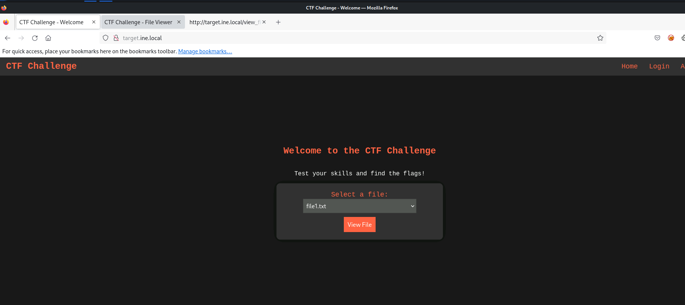

click View File

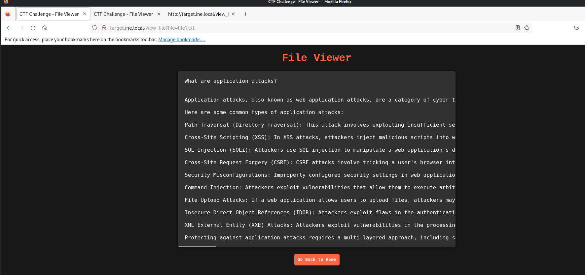

Change the directory and /flag.txt

The URL `http://target.ine.local/view_file?file=/file1.txt` suggests that the web application is fetching and displaying the contents of the file specified in the `file` parameter.

To see the flag, you need to change the parameter value to file=/flag.txt because:

1.  - If /file1.txt is accessible, and /flag.txt exists in the same directory (or is accessible via the same mechanism), changing the filename in the parameter could allow you to retrieve it

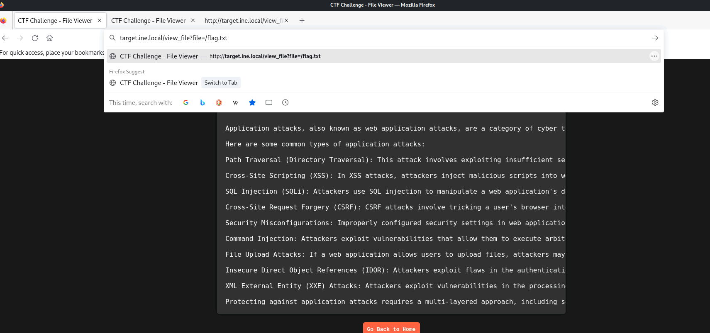

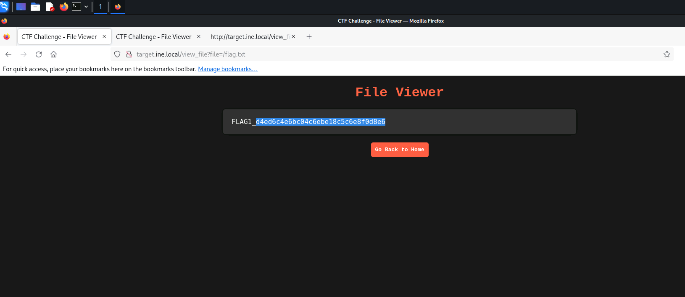

Flag Ttry to find login page and ip

cat /etc/hosts

arp -a

dig target.ine.local

nslookup target.ine.local

ping target.ine.local

and

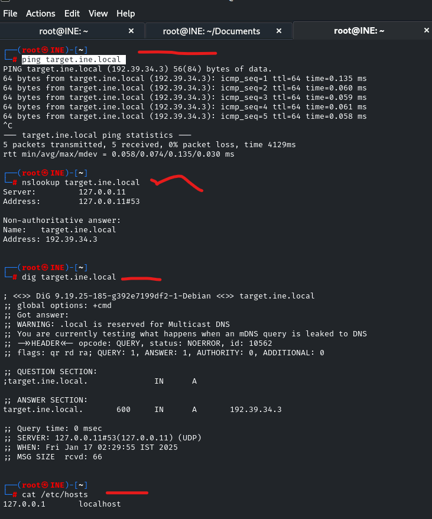

and do the

**Flag 2: Explore the structure of the server's directories. Enumeration might reveal hidden treasures.**

find the dircetories.

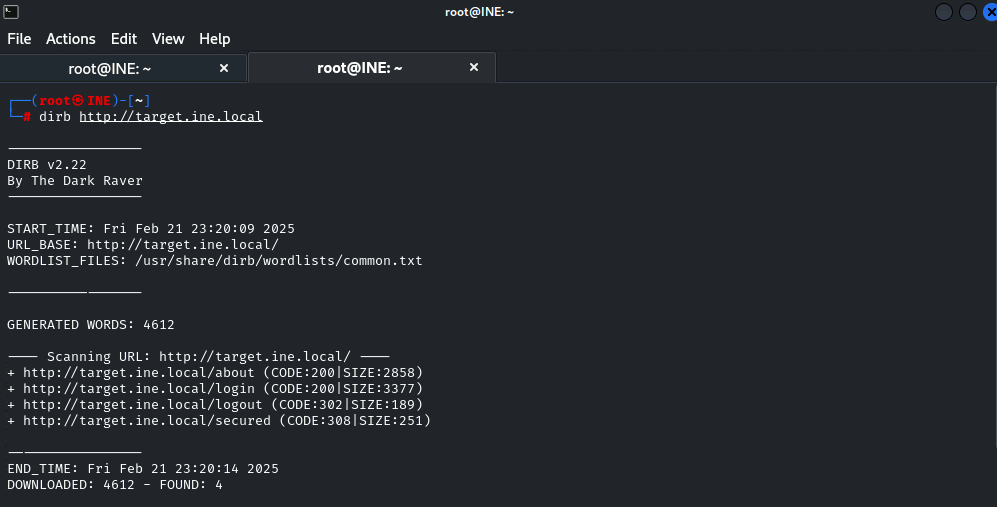

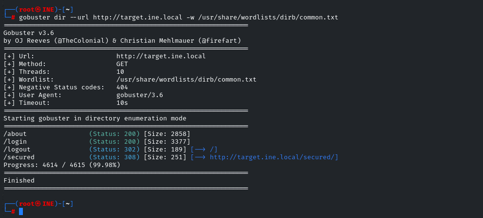

697d550c2eb5437ca64351a6fa4ba618

First go over all the directories if we can find some information http://target.ine.local/secured/ - http://target.ine.local/secured/loginb.....

and on http://target.ine.local/secured/ directory there is a flag.txt and it is a interesting lets try to open

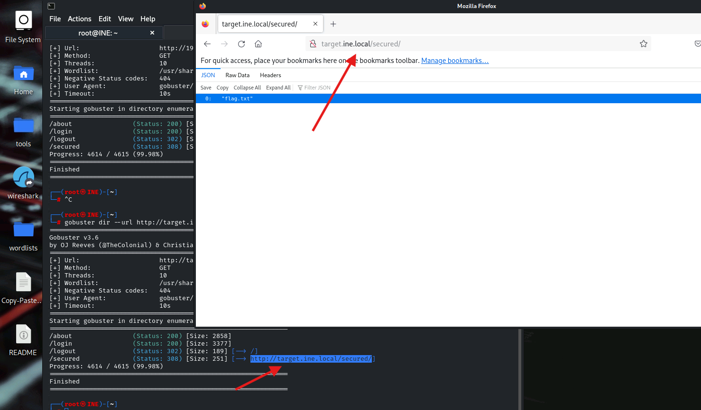

http://target.ine.local/secured/flag.txt

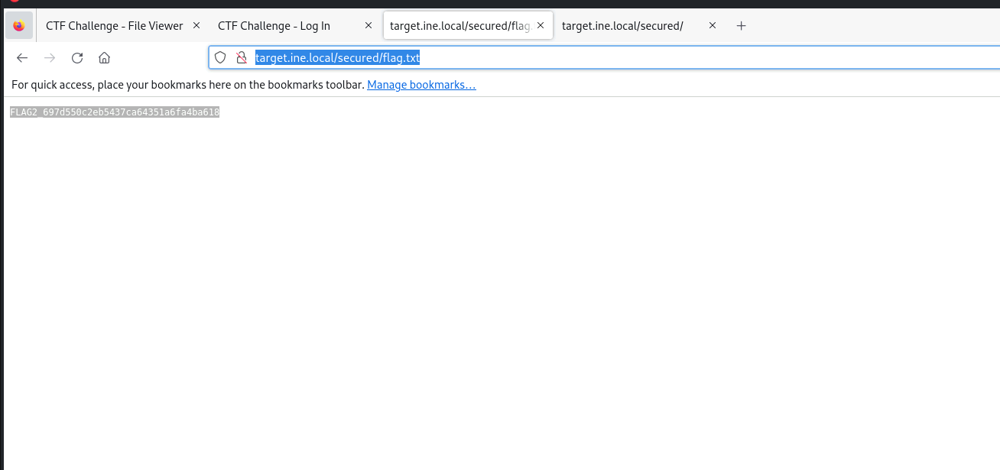

### **1\. Manual Browsing**

Try to manually access the file by navigating to the root directory of the website:

- If the website's URL is `http://example.com`, enter `http://example.com/flag.txt` in the browser's address bar.
- Sometimes, files like `flag.txt` are publicly accessible but not linked anywhere.

**Flag 3: The login form seems a bit weak. Trying out different combinations might just reveal the next flag.**

6081137d318c4858b98418f07d002edb

Do the hydra and try to find other password.

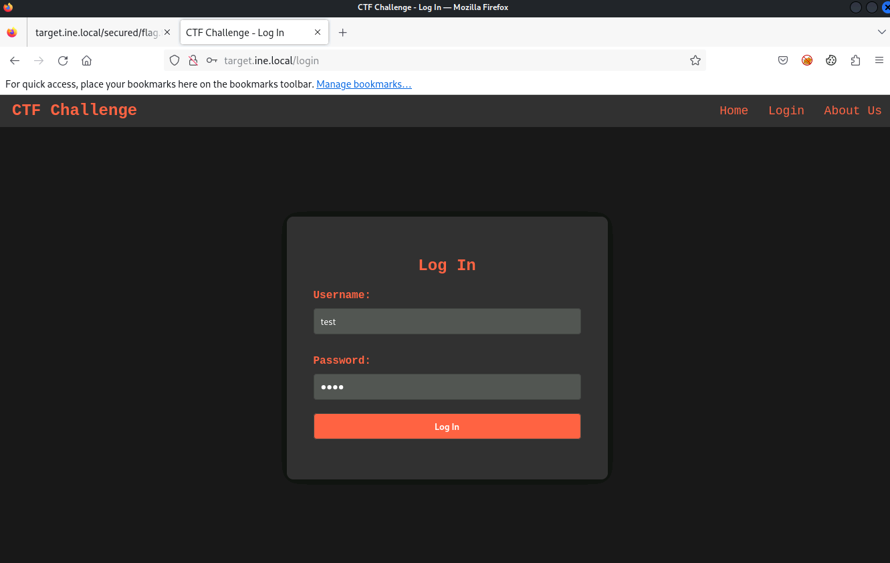

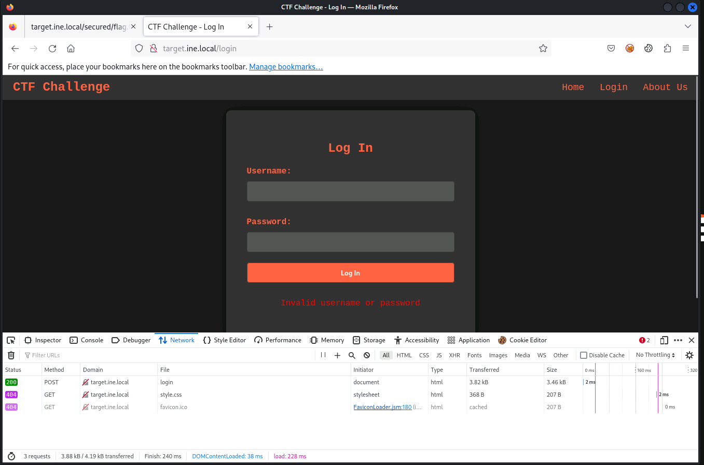

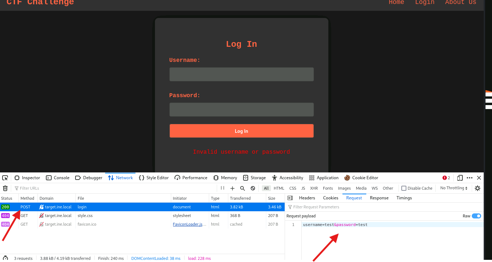


hydra -L /usr/share/seclists/Usernames/top-usernames-shortlist.txt -P '/root/Desktop/wordlists/100-common-passwords.txt' 192.39.34.3 http-post-form "/login:username=^USER^&password=^PASS^:F=Invalid username or password"


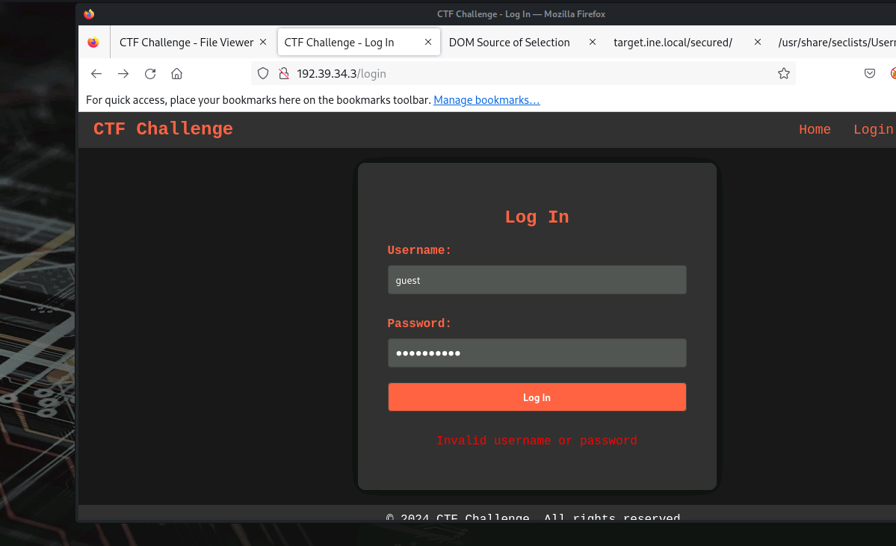


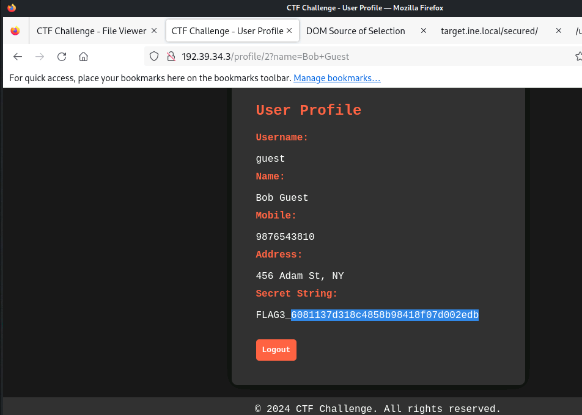

**Flag 4: The login form behaves oddly with unexpected inputs. Think of injection techniques to access the 'admin' account and find the flag.**

### 3\. **SQL Injection**

Open login page and test for SQL injection vulnerabilities in both username and password fields:

- - `admin' OR '1'='1`  
        \- `' OR '1'='1' --`  
        \- `admin' --`
- Look for changes in the login behavior, such as bypassing authentication.

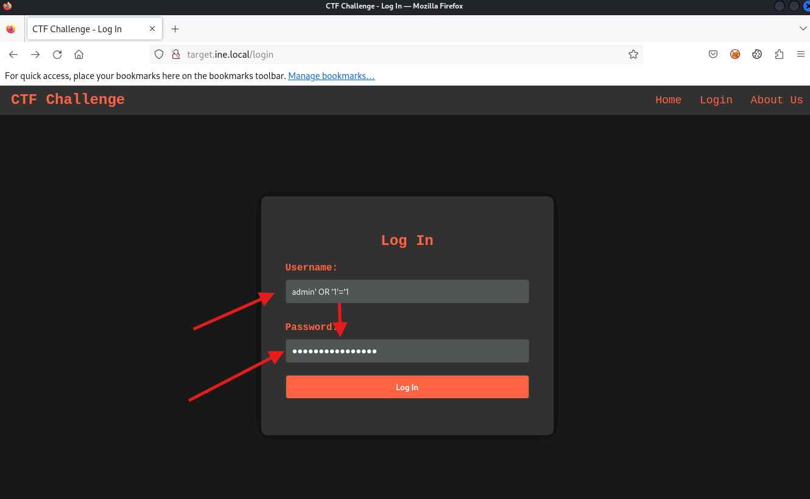

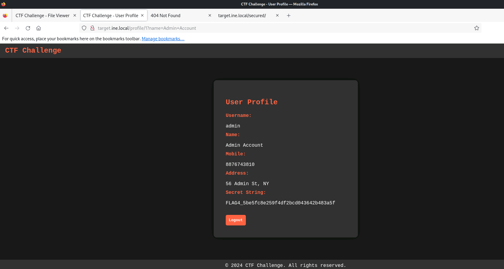
